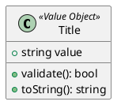
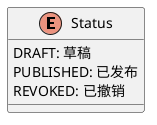
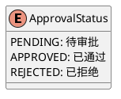

# 公告领域模型设计

## 1. 聚合设计

### 1.1 公告聚合 (Announcement Aggregate)

#### 聚合根
Announcement - 公告聚合根，负责管理公告的完整生命周期。

#### 包含实体
1. AnnouncementContent - 公告内容实体
2. AnnouncementScope - 公告范围实体
3. AnnouncementChannel - 公告渠道实体
4. AnnouncementAttachment - 公告附件实体

#### 包含值对象
1. Title - 公告标题值对象
2. Cover - 公告封面值对象
3. PublishTime - 发布时间值对象
4. Status - 公告状态值对象
5. ApprovalStatus - 审批状态值对象

#### 一致性边界
1. 公告与其内容、范围、渠道等信息保持一致
2. 公告状态变更需要同步更新相关属性
3. 公告的审批状态影响其可见性

#### 业务规则
1. 只有已审批通过的公告才能发布
2. 发布后的公告不能修改内容
3. 撤销的公告可以重新编辑并再次提交审批

### 1.2 分类聚合 (Category Aggregate)

#### 聚合根
Category - 分类聚合根，负责管理公告分类。

#### 包含实体
无

#### 包含值对象
1. Name - 分类名称值对象
2. Description - 分类描述值对象
3. Sort - 排序值对象
4. IsShow - 显示状态值对象

#### 一致性边界
1. 分类与其父子关系保持一致
2. 分类的显示状态影响其下公告的可见性

#### 业务规则
1. 父分类隐藏时，子分类也应不可见
2. 删除分类前需要确保没有关联的公告

## 2. 实体设计

### 2.1 公告实体 (Announcement)

#### 功能描述
公告实体是公告聚合的聚合根，包含公告的所有核心属性和业务方法。

#### 核心属性
- id: 公告唯一标识
- biz: 业务线标识
- owner: 所有者信息
- category: 所属分类
- title: 公告标题
- cover: 公告封面
- content: 公告内容
- scopes: 可见范围
- channels: 发布渠道
- publishTime: 发布时间
- status: 公告状态
- attachments: 附件信息
- approvalStatus: 审批状态
- isForceRead: 是否强制阅读

#### 核心方法
- publish(): 发布公告
- revoke(): 撤销公告
- submitForApproval(): 提交审批
- approve(): 审批通过
- reject(): 审批拒绝

### 2.2 分类实体 (Category)

#### 功能描述
分类实体是分类聚合的聚合根，用于管理公告分类信息。

#### 核心属性
- id: 分类唯一标识
- biz: 业务线标识
- owner: 所有者信息
- parent: 父级分类
- name: 分类名称
- description: 分类描述
- sort: 排序
- isShow: 是否显示

#### 核心方法
- show(): 显示分类
- hide(): 隐藏分类
- move(): 移动分类
- addChild(): 添加子分类

## 3. 值对象设计

### 3.1 标题 (Title)

### 3.2 状态 (Status)

### 3.3 审批状态 (ApprovalStatus)

## 4. 领域事件

### 4.1 公告相关事件

#### AnnouncementPublished
公告发布事件，当公告成功发布时触发。

#### AnnouncementRevoked
公告撤销事件，当公告被撤销时触发。

#### AnnouncementSubmittedForApproval
公告提交审批事件，当公告提交审批时触发。

#### AnnouncementApproved
公告审批通过事件，当公告审批通过时触发。

#### AnnouncementRejected
公告审批拒绝事件，当公告审批被拒绝时触发。

### 4.2 分类相关事件

#### CategoryCreated
分类创建事件，当创建新分类时触发。

#### CategoryUpdated
分类更新事件，当分类信息更新时触发。

#### CategoryDeleted
分类删除事件，当分类被删除时触发。