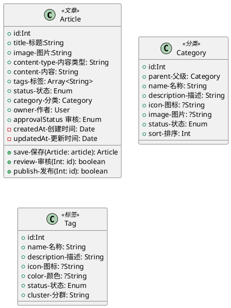
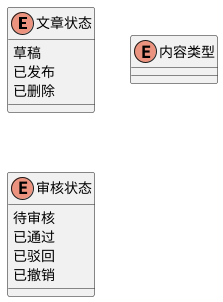

# 文章

## 领域分析

### 用例分析

- 用户 发布 文章
- 用户 修改 文章
- 管理员 审核 文章
- 管理员 删除 文章

### 核心流程

## 领域模型

### 领域服务

- 文章服务
	- 保存
	- 送审
	- 发布
	- 审核
- 分类服务
	- 创建、修改
	- 生成树结构
- 标签服务
	- 创建、修改
	- 使用查询

### 领域事件

- 文章
	- 文章创建事件
	- 文章修改事件
	- 文章送审事件
	- 文章审批事件
	- 文章发布事件
	- 文章删除事件

- 分类

### 领域仓库

### 数据库设计
