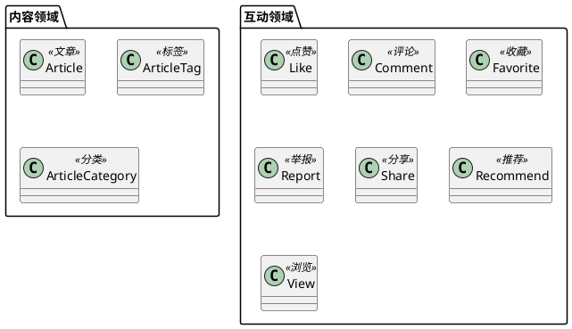

# 内容

## 概述

文章领域只要实现 CMS 的所有能力

## 统一语言

| 名称                | 中文   | 备注   |
|-------------------|------|------|
| article           | 文章   | 文章   |
| article_category  | 文章分类 | 文章分类 |
| article_tag       | 文章标签 | 文章标签 |
| article_comment   | 文章评论 | 文章评论 |
| article_like      | 文章点赞 | 文章点赞 |
| article_view      | 文章浏览 | 文章浏览 |
| article_favorite  | 文章收藏 | 文章收藏 |
| article_report    | 文章举报 | 文章举报 |
| article_share     | 文章分享 | 文章分享 |
| article_recommend | 文章推荐 | 文章推荐 |

## 领域划分

- 核心域
	- 文章
	- 分类
	- 标签
- 支撑领域
	- 评论
	- 点赞
	- 收藏

