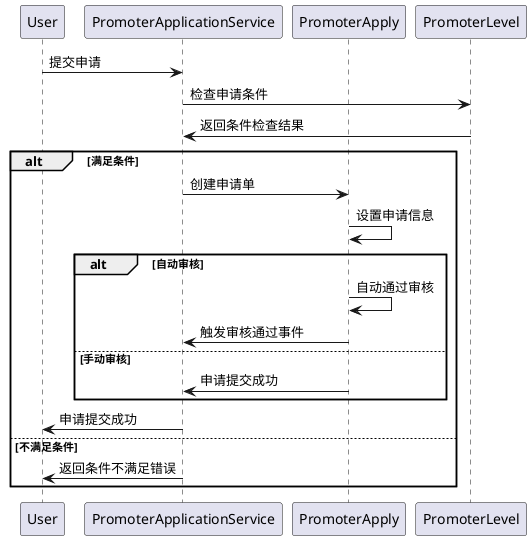
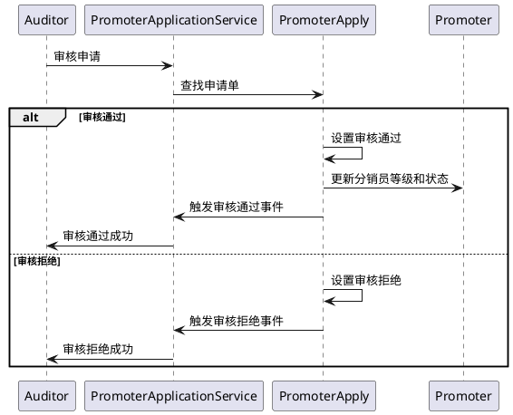

# 分销员申请模块

## 介绍

分销员申请模块负责处理用户申请成为分销员以及分销员等级升级/降级的完整流程。该模块提供灵活的申请方式和审核机制，支持自动化和人工审核两种模式。

## 领域模型

### 核心实体

#### PromoterApply（分销员申请）
- **申请ID**：唯一标识申请单
- **分销员ID**：关联的分销员
- **申请等级**：目标申请的等级
- **申请类型**：注册/升级/降级
- **申请方式**：手动/自动
- **审核方式**：手动/自动
- **审核状态**：待审核/通过/拒绝/撤销
- **申请时间**：申请提交时间
- **审核时间**：审核完成时间
- **审核理由**：审核决定的原因说明

### 值对象和枚举

#### PromoterApplyTypeEnum（申请类型）
```php
enum PromoterApplyTypeEnum: string
{
    case REGISTER = 'register';    // 注册申请
    case UPGRADE = 'upgrade';      // 升级申请  
    case DOWNGRADE = 'downgrade';  // 降级申请
}
```

#### PromoterApplyMethodEnum（申请方式）
```php
enum PromoterApplyMethodEnum: string
{
    case MANUAL = 'manual';  // 手动申请
    case AUTO = 'auto';      // 自动申请
}
```

#### PromoterApprovalMethodEnum（审核方式）
```php
enum PromoterApprovalMethodEnum: string
{
    case MANUAL = 'manual';  // 手动审核
    case AUTO = 'auto';      // 自动审核
}
```

## 领域事件

### PromoterApplyApproved（申请审核通过）
- 申请通过后触发
- 更新分销员状态和等级
- 发送通知给申请人

### PromoterApplyRejected（申请审核拒绝）
- 申请被拒绝后触发
- 记录拒绝原因
- 发送通知给申请人

## 核心规则

### 申请规则
1. **唯一性约束**：同一分销员同一时间只能有一个待审核的申请
2. **等级限制**：不能跨级申请，只能逐级升级
3. **申请条件**：必须满足目标等级的申请条件
4. **冷却期**：申请被拒绝后需等待一定时间才能重新申请

### 审核规则
1. **自动审核**：满足条件的申请自动通过
2. **人工审核**：需要人工判断的申请进入审核队列
3. **审核权限**：不同等级的申请需要不同权限的审核员
4. **审核时效**：超过指定时间未审核的申请自动作废

## 存储层表设计

### promoter_applies 表结构
```sql
CREATE TABLE `promoter_applies` (
  `id` bigint(20) UNSIGNED NOT NULL COMMENT 'ID',
  `promoter_id` bigint(20) UNSIGNED NOT NULL COMMENT '分销员ID',
  `level` tinyint(3) UNSIGNED NOT NULL COMMENT '申请等级',
  `apply_type` varchar(32) NOT NULL COMMENT '申请类型',
  `apply_method` varchar(32) NOT NULL COMMENT '申请方式',
  `approval_method` varchar(32) NOT NULL COMMENT '审核方式',
  `approval_status` varchar(32) NOT NULL COMMENT '审核状态',
  `apply_at` datetime NOT NULL COMMENT '申请时间',
  `approval_at` datetime DEFAULT NULL COMMENT '审核时间',
  `approval_reason` text COMMENT '审核理由',
  `approver_type` varchar(32) DEFAULT NULL COMMENT '审核人类型',
  `approver_id` varchar(64) DEFAULT NULL COMMENT '审核人ID',
  `approver_nickname` varchar(255) DEFAULT NULL COMMENT '审核人昵称',
  `extra` json DEFAULT NULL COMMENT '扩展信息',
  `created_at` timestamp NULL DEFAULT NULL,
  `updated_at` timestamp NULL DEFAULT NULL,
  PRIMARY KEY (`id`),
  KEY `idx_promoter` (`promoter_id`),
  KEY `idx_status` (`approval_status`),
  KEY `idx_apply_time` (`apply_at`),
  KEY `idx_level` (`level`)
) COMMENT='分销员申请';
```

### 索引设计
- **主键索引**：`id`
- **分销员索引**：`promoter_id` - 快速查询某分销员的申请记录
- **状态索引**：`approval_status` - 支持按状态筛选
- **时间索引**：`apply_at` - 支持按时间排序
- **等级索引**：`level` - 支持按等级统计

## 核心指令

### 提交申请流程



### 审核申请流程



## API 接口设计

### 提交申请接口
```http
POST /api/promoter/applies
Content-Type: application/json

{
    "level": 1,
    "apply_type": "register",
    "extra": {
        "reason": "申请成为分销员"
    }
}
```

### 审核申请接口
```http
PUT /api/admin/promoter/applies/{id}/approval
Content-Type: application/json

{
    "status": "approved",
    "reason": "审核通过，符合申请条件"
}
```

### 查询申请列表接口
```http
GET /api/admin/promoter/applies?status=pending&level=1&page=1&limit=20
```

## 业务扩展点

### 条件检查扩展
- 支持自定义申请条件检查器
- 可配置不同等级的申请条件
- 支持动态条件计算

### 审核流程扩展
- 支持多级审核流程
- 可配置审核权限矩阵
- 支持审核委托和转办

### 通知机制扩展
- 支持多种通知渠道（短信、邮件、站内信）
- 可配置通知模板
- 支持通知发送状态跟踪

## 监控指标

### 业务指标
- 申请提交量
- 审核通过率
- 审核平均耗时
- 不同等级申请分布

### 技术指标
- 接口响应时间
- 数据库查询性能
- 事件处理延迟
- 异常错误率 