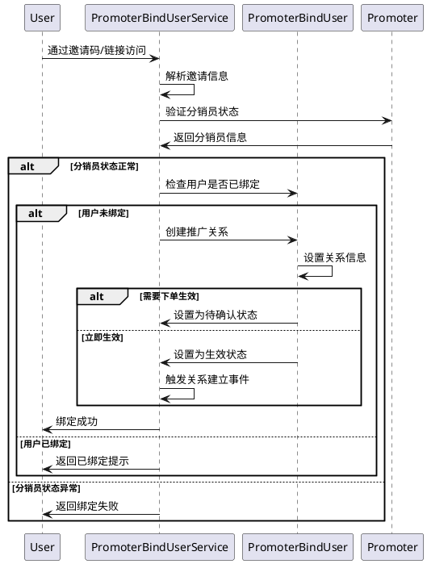
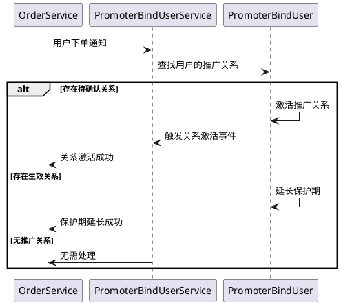
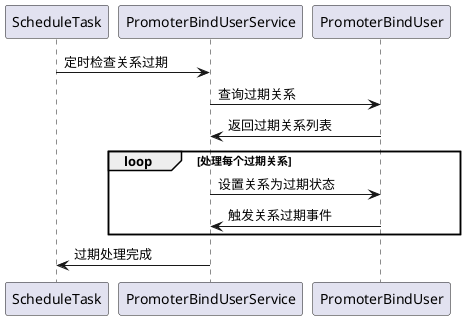

# 推广关系绑定模块

## 介绍

推广关系绑定模块负责管理分销员与用户之间的推广关系，实现分销员通过邀请码、推广链接等方式绑定用户，建立稳定的推广关系网络。该模块采用"绑客模式"，确保用户与分销员的关系唯一性和稳定性。

## 领域模型

### 核心实体

#### PromoterBindUser（推广关系）
- **关系ID**：唯一标识推广关系
- **分销员ID**：推广的分销员
- **用户ID**：被推广的用户
- **绑定方式**：邀请码/推广链接/手动绑定
- **关系状态**：待确认/生效/过期/解除
- **绑定时间**：关系建立时间
- **生效时间**：关系开始生效时间
- **过期时间**：关系过期时间
- **保护期**：关系保护截止时间

### 值对象和枚举

#### BindMethodEnum（绑定方式）
```php
enum BindMethodEnum: string
{
    case INVITATION_CODE = 'invitation_code';  // 邀请码
    case PROMOTION_LINK = 'promotion_link';    // 推广链接
    case MANUAL_BIND = 'manual_bind';          // 手动绑定
    case QR_CODE = 'qr_code';                  // 二维码扫描
}
```

#### RelationStatusEnum（关系状态）
```php
enum RelationStatusEnum: string
{
    case PENDING = 'pending';      // 待确认
    case ACTIVE = 'active';        // 生效中
    case EXPIRED = 'expired';      // 已过期
    case CANCELLED = 'cancelled';  // 已解除
}
```

### 业务规则配置

#### 绑客模式配置
```php
class BindUserConfig
{
    public int $validityDays = 365;        // 关系有效期（天）
    public int $protectionDays = 30;       // 关系保护期（天）
    public bool $requireOrder = true;      // 是否需要下单才生效
    public int $orderTimeoutHours = 24;    // 下单超时时间（小时）
    public bool $allowRebind = false;      // 是否允许重新绑定
}
```

## 领域事件

### RelationshipEstablished（推广关系建立）
- 新建推广关系时触发
- 记录关系建立日志
- 发送绑定成功通知

### RelationshipActivated（推广关系激活）
- 关系从待确认变为生效时触发
- 通常在用户首次下单后激活
- 开始计算佣金分配

### RelationshipExpired（推广关系过期）
- 关系过期时触发
- 停止佣金分配
- 清理相关缓存数据

### RelationshipCancelled（推广关系解除）
- 手动解除关系时触发
- 处理已产生但未结算的佣金
- 记录解除原因

## 核心规则

### 绑定规则
1. **唯一性原则**：每个用户同时只能被一个分销员推广
2. **优先级原则**：先绑定的关系优先，后续绑定请求被拒绝
3. **有效期限制**：关系具有明确的有效期，过期后自动失效
4. **保护期机制**：保护期内产生的订单都归属于推广分销员

### 生效规则
1. **即时生效**：通过邀请码注册的用户关系立即生效
2. **下单生效**：通过推广链接访问的用户需要下单才生效
3. **时效限制**：访问推广链接后需在指定时间内下单
4. **条件检查**：生效前需检查分销员状态是否正常

### 保护规则
1. **保护期内独占**：保护期内用户所有订单都归属于推广分销员
2. **保护期延长**：每次下单可延长保护期
3. **保护期上限**：保护期有最大时长限制
4. **保护期冲突**：新旧保护期冲突时的处理策略

## 存储层表设计

### promoter_bind_users 表结构
```sql
CREATE TABLE `promoter_bind_users` (
  `id` bigint(20) UNSIGNED NOT NULL COMMENT 'ID',
  `promoter_id` bigint(20) UNSIGNED NOT NULL COMMENT '分销员ID',
  `user_type` varchar(32) NOT NULL COMMENT '用户类型',
  `user_id` varchar(64) NOT NULL COMMENT '用户ID',
  `bind_method` varchar(32) NOT NULL COMMENT '绑定方式',
  `status` varchar(32) NOT NULL COMMENT '关系状态',
  `bind_at` datetime NOT NULL COMMENT '绑定时间',
  `active_at` datetime DEFAULT NULL COMMENT '生效时间',
  `expire_at` datetime DEFAULT NULL COMMENT '过期时间',
  `protection_expire_at` datetime DEFAULT NULL COMMENT '保护期过期时间',
  `source_data` json DEFAULT NULL COMMENT '来源数据',
  `extra` json DEFAULT NULL COMMENT '扩展信息',
  `created_at` timestamp NULL DEFAULT NULL,
  `updated_at` timestamp NULL DEFAULT NULL,
  PRIMARY KEY (`id`),
  UNIQUE KEY `uk_user` (`user_type`, `user_id`),
  KEY `idx_promoter` (`promoter_id`),
  KEY `idx_status` (`status`),
  KEY `idx_expire` (`expire_at`),
  KEY `idx_protection` (`protection_expire_at`)
) COMMENT='推广关系绑定';
```

### 索引设计
- **主键索引**：`id`
- **用户唯一索引**：`user_type`, `user_id` - 确保用户唯一性
- **分销员索引**：`promoter_id` - 快速查询分销员的推广用户
- **状态索引**：`status` - 支持按状态筛选
- **过期时间索引**：`expire_at` - 支持定时任务清理过期关系
- **保护期索引**：`protection_expire_at` - 支持保护期查询

## 核心指令

### 建立推广关系流程



### 关系激活流程



### 关系过期处理流程



## API 接口设计

### 建立推广关系接口
```http
POST /api/promoter/bind-user
Content-Type: application/json

{
    "invitation_code": "ABC123",
    "user_id": "123456",
    "bind_method": "invitation_code",
    "source": "mobile_app"
}
```

### 查询推广关系接口
```http
GET /api/promoter/bind-users/{promoter_id}?status=active&page=1&limit=20
```

### 解除推广关系接口
```http
DELETE /api/admin/promoter/bind-users/{id}
Content-Type: application/json

{
    "reason": "用户申请解除关系"
}
```

## 业务场景

### 场景1：邀请码注册
1. 分销员分享邀请码给朋友
2. 朋友使用邀请码注册账号
3. 系统自动建立推广关系，立即生效
4. 朋友后续下单产生的佣金归属分销员

### 场景2：推广链接下单
1. 分销员分享商品推广链接
2. 用户点击链接访问商品页面
3. 系统记录推广关系为待确认状态
4. 用户下单后关系激活，开始计算佣金

### 场景3：关系保护期
1. 用户通过分销员A的链接首次下单
2. 建立推广关系，设置30天保护期
3. 期间用户通过其他渠道下单仍归属分销员A
4. 保护期过后，用户可建立新的推广关系

### 场景4：关系过期处理
1. 系统定时检查所有推广关系
2. 发现超过有效期的关系
3. 自动设置为过期状态
4. 停止后续佣金计算，清理缓存数据

## 业务扩展点

### 绑定策略扩展
- 支持多种绑定条件配置
- 可设置不同商品类型的绑定规则
- 支持区域性绑定策略

### 关系管理扩展
- 支持关系转移功能
- 可配置关系优先级策略
- 支持临时关系和永久关系

### 数据统计扩展
- 推广关系建立趋势分析
- 不同绑定方式的转化率统计
- 关系生命周期分析

## 监控指标

### 业务指标
- 日新增推广关系数
- 关系激活率
- 平均关系有效期
- 不同绑定方式占比

### 技术指标
- 关系查询响应时间
- 过期关系清理效率
- 并发绑定处理能力
- 数据一致性检查结果

## 常见问题

### Q1：用户已有推广关系，如何处理新的绑定请求？
A1：根据业务规则，通常拒绝新的绑定请求，保持关系的唯一性。特殊情况下可支持关系转移。

### Q2：推广关系过期后，历史佣金如何处理？
A2：已结算的佣金不受影响，未结算的佣金根据业务规则决定是否继续结算。

### Q3：如何防止分销员恶意刷关系？
A3：通过设置绑定频率限制、用户真实性验证、异常行为监控等手段防范。

### Q4：关系保护期冲突如何处理？
A4：通常以最长保护期为准，或者根据业务重要性设置优先级策略。 