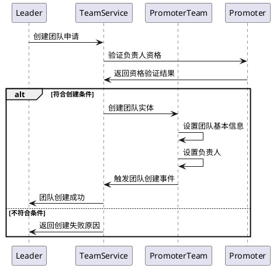
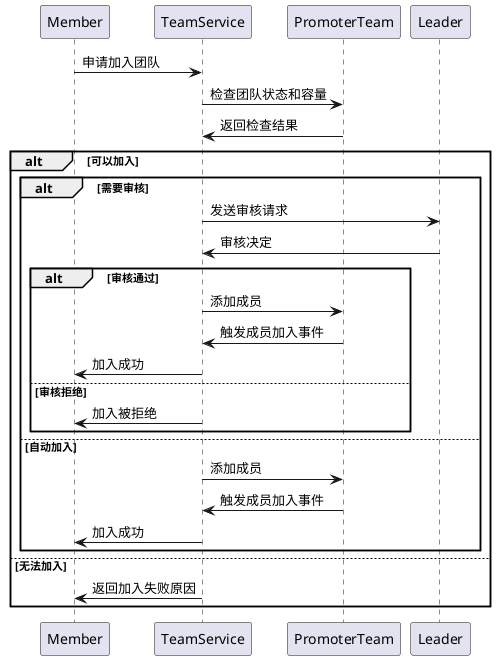
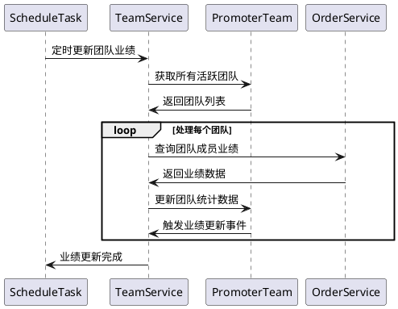

# 分销员团队管理模块

## 介绍

分销员团队管理模块负责管理分销员的团队组织结构，支持团队创建、成员管理、业绩统计、层级管理等功能。通过团队化管理，可以更好地组织分销网络，提升管理效率和业绩表现。

## 领域模型

### 核心实体

#### PromoterTeam（分销员团队）
- **团队ID**：唯一标识团队
- **团队名称**：团队显示名称
- **团队描述**：团队简介和说明
- **团队类型**：区域团队/产品团队/等级团队
- **团队负责人**：团队的管理者
- **上级团队**：父级团队，支持多层级结构
- **团队状态**：活跃/暂停/解散
- **创建时间**：团队成立时间
- **统计数据**：团队业绩统计信息

#### 团队统计数据
- **团队成员数**：当前团队成员总数
- **累计销售额**：团队历史总销售额
- **累计佣金**：团队历史总佣金
- **累计订单数**：团队历史总订单数
- **累计客户数**：团队服务的客户总数
- **本月业绩**：当月团队业绩数据
- **上月业绩**：上月团队业绩数据

### 值对象和枚举

#### TeamTypeEnum（团队类型）
```php
enum TeamTypeEnum: string
{
    case REGIONAL = 'regional';    // 区域团队
    case PRODUCT = 'product';      // 产品团队
    case LEVEL = 'level';          // 等级团队
    case CUSTOM = 'custom';        // 自定义团队
}
```

#### TeamStatusEnum（团队状态）
```php
enum TeamStatusEnum: string
{
    case ACTIVE = 'active';        // 活跃
    case SUSPENDED = 'suspended';  // 暂停
    case DISBANDED = 'disbanded';  // 解散
}
```

#### MemberRoleEnum（成员角色）
```php
enum MemberRoleEnum: string
{
    case LEADER = 'leader';        // 团队负责人
    case MANAGER = 'manager';      // 团队管理员
    case MEMBER = 'member';        // 普通成员
}
```

## 领域事件

### TeamCreated（团队创建）
- 新团队创建时触发
- 初始化团队统计数据
- 发送团队创建通知

### MemberJoined（成员加入）
- 新成员加入团队时触发
- 更新团队成员数统计
- 发送欢迎通知

### MemberLeft（成员离开）
- 成员离开团队时触发
- 更新团队统计数据
- 处理权限变更

### TeamDisbanded（团队解散）
- 团队解散时触发
- 处理成员转移
- 清理团队数据

### TeamPerformanceUpdated（团队业绩更新）
- 团队业绩数据变更时触发
- 更新排行榜数据
- 触发业绩奖励计算

## 核心规则

### 团队管理规则
1. **层级限制**：团队层级不超过指定深度（如5级）
2. **负责人唯一**：每个团队只能有一个负责人
3. **成员限制**：团队成员数量有上限，防止过度集中
4. **权限控制**：不同角色有不同的管理权限

### 成员管理规则
1. **唯一性约束**：每个分销员同时只能属于一个团队
2. **等级要求**：加入团队可能需要满足等级要求
3. **审核机制**：加入团队可能需要负责人审核
4. **退出限制**：退出团队可能有冷却期限制

### 业绩计算规则
1. **累计统计**：团队业绩为所有成员业绩之和
2. **时间维度**：支持按日、周、月、年统计
3. **数据延迟**：业绩数据可能有计算延迟
4. **历史保留**：成员离开后历史业绩仍计入团队

### 奖励分配规则
1. **团队奖励**：基于团队整体业绩的奖励
2. **个人奖励**：基于个人在团队中贡献的奖励
3. **管理奖励**：团队负责人的管理奖励
4. **排名奖励**：基于团队排名的阶梯奖励

## 存储层表设计

### promoter_teams 表结构
```sql
CREATE TABLE `promoter_teams` (
  `id` bigint(20) UNSIGNED NOT NULL COMMENT 'ID',
  `name` varchar(255) NOT NULL COMMENT '团队名称',
  `description` text COMMENT '团队描述',
  `type` varchar(32) NOT NULL COMMENT '团队类型',
  `leader_id` bigint(20) UNSIGNED NOT NULL COMMENT '团队负责人ID',
  `parent_id` bigint(20) UNSIGNED DEFAULT NULL COMMENT '上级团队ID',
  `status` varchar(32) NOT NULL COMMENT '团队状态',
  `level` tinyint(3) UNSIGNED DEFAULT 1 COMMENT '团队层级',
  `max_members` int(10) UNSIGNED DEFAULT 100 COMMENT '最大成员数',
  `member_count` int(10) UNSIGNED DEFAULT 0 COMMENT '当前成员数',
  `total_sales` decimal(15,2) DEFAULT 0.00 COMMENT '累计销售额',
  `total_commission` decimal(15,2) DEFAULT 0.00 COMMENT '累计佣金',
  `total_orders` int(10) UNSIGNED DEFAULT 0 COMMENT '累计订单数',
  `total_customers` int(10) UNSIGNED DEFAULT 0 COMMENT '累计客户数',
  `month_sales` decimal(15,2) DEFAULT 0.00 COMMENT '本月销售额',
  `month_commission` decimal(15,2) DEFAULT 0.00 COMMENT '本月佣金',
  `month_orders` int(10) UNSIGNED DEFAULT 0 COMMENT '本月订单数',
  `last_month_sales` decimal(15,2) DEFAULT 0.00 COMMENT '上月销售额',
  `last_month_commission` decimal(15,2) DEFAULT 0.00 COMMENT '上月佣金',
  `last_month_orders` int(10) UNSIGNED DEFAULT 0 COMMENT '上月订单数',
  `created_at` timestamp NULL DEFAULT NULL,
  `updated_at` timestamp NULL DEFAULT NULL,
  PRIMARY KEY (`id`),
  KEY `idx_leader` (`leader_id`),
  KEY `idx_parent` (`parent_id`),
  KEY `idx_status` (`status`),
  KEY `idx_type` (`type`),
  KEY `idx_level` (`level`)
) COMMENT='分销员团队';
```

### promoter_team_members 表结构
```sql
CREATE TABLE `promoter_team_members` (
  `id` bigint(20) UNSIGNED NOT NULL COMMENT 'ID',
  `team_id` bigint(20) UNSIGNED NOT NULL COMMENT '团队ID',
  `promoter_id` bigint(20) UNSIGNED NOT NULL COMMENT '分销员ID',
  `role` varchar(32) NOT NULL COMMENT '成员角色',
  `joined_at` datetime NOT NULL COMMENT '加入时间',
  `left_at` datetime DEFAULT NULL COMMENT '离开时间',
  `status` varchar(32) NOT NULL COMMENT '成员状态',
  `personal_sales` decimal(15,2) DEFAULT 0.00 COMMENT '个人销售额',
  `personal_commission` decimal(15,2) DEFAULT 0.00 COMMENT '个人佣金',
  `personal_orders` int(10) UNSIGNED DEFAULT 0 COMMENT '个人订单数',
  `created_at` timestamp NULL DEFAULT NULL,
  `updated_at` timestamp NULL DEFAULT NULL,
  PRIMARY KEY (`id`),
  UNIQUE KEY `uk_team_promoter` (`team_id`, `promoter_id`),
  KEY `idx_promoter` (`promoter_id`),
  KEY `idx_role` (`role`),
  KEY `idx_status` (`status`)
) COMMENT='团队成员';
```

## 核心指令

### 创建团队流程



### 成员加入团队流程



### 团队业绩统计流程



## API 接口设计

### 创建团队接口
```http
POST /api/promoter/teams
Content-Type: application/json

{
    "name": "华南区销售团队",
    "description": "负责华南地区产品销售推广",
    "type": "regional",
    "max_members": 50
}
```

### 加入团队接口
```http
POST /api/promoter/teams/{team_id}/join
Content-Type: application/json

{
    "reason": "希望加入团队学习和发展"
}
```

### 团队业绩查询接口
```http
GET /api/promoter/teams/{team_id}/performance?period=month&year=2024&month=12
```

### 团队成员管理接口
```http
PUT /api/promoter/teams/{team_id}/members/{member_id}
Content-Type: application/json

{
    "role": "manager",
    "action": "promote"
}
```

## 业务场景

### 场景1：区域团队管理
1. 总部设立华南、华北、华东等区域团队
2. 各区域负责人招募本地分销员加入
3. 系统按区域统计业绩和排名
4. 区域间进行业绩PK和奖励

### 场景2：等级团队晋升
1. 系统自动为不同等级分销员创建团队
2. 分销员等级提升后自动转入相应团队
3. 高等级团队享有更多权益和资源
4. 团队内部形成学习和互助氛围

### 场景3：产品专业团队
1. 为特定产品线创建专业推广团队
2. 招募对该产品有经验的分销员
3. 提供专业培训和推广支持
4. 按产品线进行精细化管理

### 场景4：团队业绩竞赛
1. 定期举办团队业绩竞赛活动
2. 设置不同奖项和奖励机制
3. 实时更新团队排行榜
4. 激发团队协作和竞争积极性

## 业务扩展点

### 团队类型扩展
- 支持自定义团队类型
- 可配置不同类型的特殊规则
- 支持临时团队和永久团队

### 权限管理扩展
- 支持细粒度权限控制
- 可配置角色权限矩阵
- 支持权限委托和代理

### 激励机制扩展
- 支持多种团队激励方案
- 可配置阶梯奖励规则
- 支持团队荣誉体系

### 数据分析扩展
- 团队业绩趋势分析
- 成员贡献度分析
- 团队效率评估
- 竞争对手分析

## 监控指标

### 业务指标
- 活跃团队数量
- 平均团队规模
- 团队业绩增长率
- 成员流失率
- 团队创建/解散比例

### 管理指标
- 团队管理效率
- 成员满意度
- 权限使用情况
- 审核处理时效
- 业绩统计准确性

### 技术指标
- API响应时间
- 数据计算性能
- 并发处理能力
- 数据一致性
- 系统稳定性

## 最佳实践

### 团队组建建议
1. **明确团队目标**：设定清晰的团队目标和定位
2. **合理规模控制**：避免团队过大难以管理
3. **能力互补**：招募能力互补的成员
4. **文化建设**：建立积极的团队文化

### 管理运营建议
1. **定期沟通**：建立定期的团队沟通机制
2. **公平激励**：制定公平的激励和奖惩制度
3. **培训支持**：提供持续的培训和支持
4. **数据透明**：保持业绩数据的透明和及时

### 系统优化建议
1. **性能优化**：大团队的业绩统计需要优化性能
2. **缓存策略**：合理使用缓存提升查询效率
3. **异步处理**：业绩计算采用异步处理
4. **数据分片**：大规模数据可考虑分片存储

## 常见问题

### Q1：团队负责人离职如何处理？
A1：系统支持负责人转移功能，可指定新的负责人或由上级团队接管。

### Q2：成员在团队间频繁跳转如何控制？
A2：可设置跳转冷却期，限制成员在指定时间内的跳转次数。

### Q3：团队业绩统计有延迟如何处理？
A3：采用异步计算和缓存机制，同时提供手动刷新功能。

### Q4：如何防止恶意创建大量团队？
A4：设置创建团队的条件限制，如等级要求、业绩要求等。 