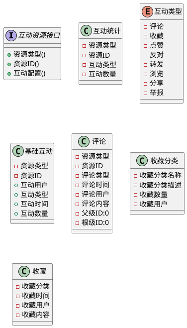

# 互动

## 概述

此组件是一个交互组件，用于实现用户与页面的交互。评论、收藏、点赞、返回、浏览、分享等数据的统计。

## 统一语言表

| 名称                 | 中文 | 备注          |
|--------------------|----|-------------|
| InterationResource | 互动资源 | 如：文章、话题、笔记等 |
| InterationType     | 互动类型 | 如：评论、收藏、点赞等 |
| InterationUser     | 互动用户 | 用户信息       |
| InterationCount     | 互动数量 | 互动数量       |
| InterationTime      | 互动时间 | 互动时间       |

## 领域实体

