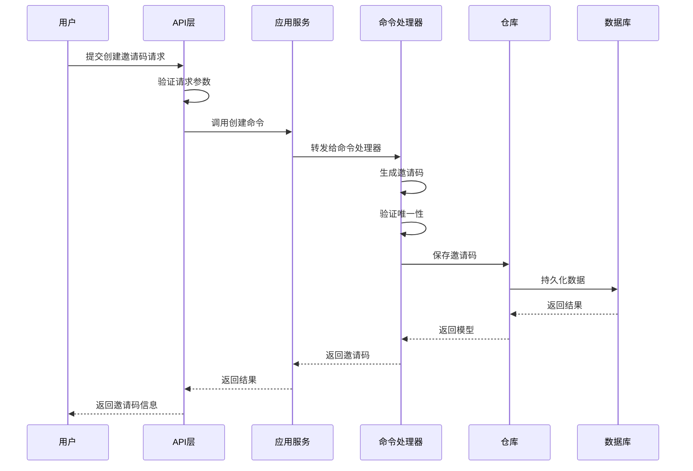
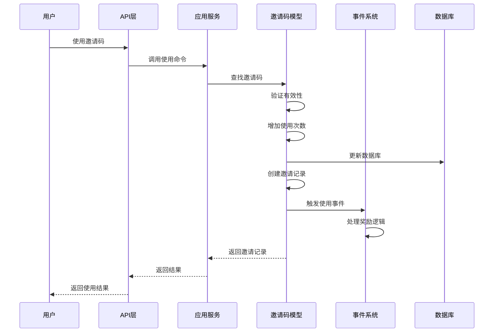
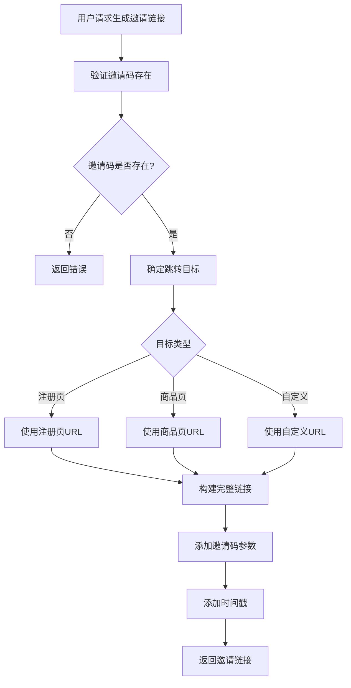

# 邀请领域技术方案

## 概述

邀请领域主要负责处理邀请码和邀请链接相关的业务逻辑，为系统提供灵活的用户邀请机制。支持多种邀请方式，包括自定义邀请码、系统生成邀请码，以及可配置的邀请链接。

### 核心能力

1. **邀请码管理**：支持自定义和系统生成两种方式创建邀请码
2. **使用控制**：支持使用次数限制和过期时间控制
3. **邀请链接**：支持生成可配置跳转目标的邀请链接
4. **邀请统计**：提供邀请效果统计和分析
5. **邀请记录**：记录邀请关系和使用情况

### 技术架构

采用DDD架构设计，分为以下层次：
- **领域层**：核心业务逻辑和领域模型
- **应用层**：用例编排和业务流程
- **基础设施层**：数据持久化和外部集成
- **用户接口层**：API接口和用户交互

## 领域模型设计

### 领域模型图

<!--@include: ./model.puml-->

### 核心实体

#### 1. 邀请码（InvitationCode）
```php
/**
 * 邀请码领域模型
 * 
 * 核心职责：
 * - 管理邀请码的生命周期
 * - 控制邀请码的使用次数和有效期
 * - 记录邀请码的使用情况
 */
class InvitationCode extends Model implements OwnerInterface, OperatorInterface
{
    use HasSnowflakeId;
    use HasOwner;
    use HasOperator;
    
    public $incrementing = false;
    
    protected $ownerColumn = 'inviter';
    protected $withOwnerNickname = true;
    protected $withOwnerAvatar = true;
    
    protected function casts(): array
    {
        return [
            'code_type'      => InvitationCodeTypeEnum::class,
            'status'         => InvitationCodeStatusEnum::class,
            'target_type'    => InvitationTargetTypeEnum::class,
            'max_usage'      => 'integer',
            'used_count'     => 'integer',
            'expired_at'     => 'datetime',
            'extra_data'     => 'array',
        ];
    }
    
    /**
     * 使用邀请码
     */
    public function use(UserInterface $invitee, array $context = []): InvitationRecord
    {
        // 验证邀请码是否可用
        $this->validateUsage();
        
        // 增加使用次数
        $this->increment('used_count');
        
        // 检查是否达到最大使用次数
        if ($this->max_usage > 0 && $this->used_count >= $this->max_usage) {
            $this->status = InvitationCodeStatusEnum::EXHAUSTED;
            $this->save();
        }
        
        // 触发邀请使用事件
        event(new InvitationCodeUsed($this, $invitee, $context));
        
        return $this->createInvitationRecord($invitee, $context);
    }
    
    /**
     * 验证邀请码是否可用
     */
    public function validateUsage(): void
    {
        if ($this->status !== InvitationCodeStatusEnum::ACTIVE) {
            throw new InvitationCodeNotAvailableException('邀请码不可用');
        }
        
        if ($this->expired_at && $this->expired_at->isPast()) {
            throw new InvitationCodeExpiredException('邀请码已过期');
        }
        
        if ($this->max_usage > 0 && $this->used_count >= $this->max_usage) {
            throw new InvitationCodeExhaustedException('邀请码使用次数已用完');
        }
    }
    
    /**
     * 创建邀请记录
     */
    private function createInvitationRecord(UserInterface $invitee, array $context): InvitationRecord
    {
        return InvitationRecord::create([
            'invitation_code_id' => $this->id,
            'inviter_type'       => $this->inviter_type,
            'inviter_id'         => $this->inviter_id,
            'invitee_type'       => $invitee->getMorphClass(),
            'invitee_id'         => $invitee->getKey(),
            'invitee_nickname'   => $invitee->getNickname(),
            'context'            => $context,
            'invited_at'         => now(),
        ]);
    }
    
    /**
     * 生成邀请链接
     */
    public function generateInvitationUrl(?string $targetUrl = null): string
    {
        $baseUrl = $targetUrl ?: $this->getDefaultTargetUrl();
        
        return $baseUrl . '?' . http_build_query([
            'invitation_code' => $this->code,
            'from'           => 'invitation',
            'timestamp'      => time(),
        ]);
    }
    
    /**
     * 获取默认跳转URL
     */
    private function getDefaultTargetUrl(): string
    {
        return match($this->target_type) {
            InvitationTargetTypeEnum::REGISTER => config('invitation.targets.register'),
            InvitationTargetTypeEnum::PRODUCT  => config('invitation.targets.product'),
            InvitationTargetTypeEnum::CUSTOM   => $this->target_url,
            default => config('invitation.targets.default'),
        };
    }
}
```

#### 2. 邀请记录（InvitationRecord）
```php
/**
 * 邀请记录领域模型
 * 
 * 核心职责：
 * - 记录邀请关系
 * - 追踪邀请效果
 * - 支持邀请奖励计算
 */
class InvitationRecord extends Model implements OperatorInterface
{
    use HasSnowflakeId;
    use HasOperator;
    
    public $incrementing = false;
    
    protected function casts(): array
    {
        return [
            'context'      => 'array',
            'rewards'      => 'array',
            'invited_at'   => 'datetime',
            'completed_at' => 'datetime',
        ];
    }
    
    /**
     * 邀请码关联
     */
    public function invitationCode(): BelongsTo
    {
        return $this->belongsTo(InvitationCode::class);
    }
    
    /**
     * 邀请人关联
     */
    public function inviter(): MorphTo
    {
        return $this->morphTo();
    }
    
    /**
     * 被邀请人关联
     */
    public function invitee(): MorphTo
    {
        return $this->morphTo();
    }
    
    /**
     * 完成邀请
     */
    public function complete(array $rewards = []): void
    {
        $this->completed_at = now();
        $this->rewards = $rewards;
        $this->save();
        
        // 触发邀请完成事件
        event(new InvitationCompleted($this));
    }
}
```

### 值对象

#### 1. 邀请码配置（InvitationCodeConfig）
```php
/**
 * 邀请码配置值对象
 */
class InvitationCodeConfig
{
    public function __construct(
        public readonly InvitationCodeTypeEnum $codeType,
        public readonly ?string $customCode,
        public readonly int $maxUsage,
        public readonly ?Carbon $expiredAt,
        public readonly InvitationTargetTypeEnum $targetType,
        public readonly ?string $targetUrl,
        public readonly array $extraData = []
    ) {}
    
    /**
     * 生成邀请码
     */
    public function generateCode(): string
    {
        if ($this->codeType === InvitationCodeTypeEnum::CUSTOM) {
            return $this->customCode;
        }
        
        return $this->generateSystemCode();
    }
    
    /**
     * 生成系统邀请码
     */
    private function generateSystemCode(): string
    {
        do {
            $code = $this->createRandomCode();
        } while (InvitationCode::where('code', $code)->exists());
        
        return $code;
    }
    
    /**
     * 创建随机码
     */
    private function createRandomCode(): string
    {
        $characters = 'ABCDEFGHIJKLMNOPQRSTUVWXYZ0123456789';
        $code = '';
        
        for ($i = 0; $i < 8; $i++) {
            $code .= $characters[random_int(0, strlen($characters) - 1)];
        }
        
        return $code;
    }
}
```

### 枚举定义

```php
/**
 * 邀请码类型枚举
 */
enum InvitationCodeTypeEnum: string
{
    case SYSTEM = 'system';  // 系统生成
    case CUSTOM = 'custom';  // 自定义
}

/**
 * 邀请码状态枚举
 */
enum InvitationCodeStatusEnum: string
{
    case ACTIVE    = 'active';     // 激活
    case DISABLED  = 'disabled';   // 禁用
    case EXPIRED   = 'expired';    // 过期
    case EXHAUSTED = 'exhausted';  // 用尽
}

/**
 * 邀请目标类型枚举
 */
enum InvitationTargetTypeEnum: string
{
    case REGISTER = 'register';  // 注册页
    case PRODUCT  = 'product';   // 商品页
    case CUSTOM   = 'custom';    // 自定义
}
```

## 数据库设计

### 邀请码表（invitation_codes）
```sql
CREATE TABLE `invitation_codes` (
    `id` BIGINT UNSIGNED NOT NULL COMMENT '雪花ID',
    `code` VARCHAR(32) NOT NULL COMMENT '邀请码',
    `code_type` VARCHAR(20) NOT NULL DEFAULT 'system' COMMENT '邀请码类型：system-系统生成，custom-自定义',
    `status` VARCHAR(20) NOT NULL DEFAULT 'active' COMMENT '状态：active-激活，disabled-禁用，expired-过期，exhausted-用尽',
    
    -- 邀请人信息
    `inviter_type` VARCHAR(100) NOT NULL COMMENT '邀请人类型',
    `inviter_id` BIGINT UNSIGNED NOT NULL COMMENT '邀请人ID',
    `inviter_nickname` VARCHAR(100) NULL COMMENT '邀请人昵称',
    `inviter_avatar` VARCHAR(500) NULL COMMENT '邀请人头像',
    
    -- 使用控制
    `max_usage` INT UNSIGNED NOT NULL DEFAULT 0 COMMENT '最大使用次数，0表示无限制',
    `used_count` INT UNSIGNED NOT NULL DEFAULT 0 COMMENT '已使用次数',
    `expired_at` TIMESTAMP NULL COMMENT '过期时间',
    
    -- 跳转配置
    `target_type` VARCHAR(20) NOT NULL DEFAULT 'register' COMMENT '目标类型：register-注册页，product-商品页，custom-自定义',
    `target_url` VARCHAR(500) NULL COMMENT '自定义跳转URL',
    
    -- 扩展信息
    `extra_data` JSON NULL COMMENT '扩展数据',
    `description` VARCHAR(500) NULL COMMENT '描述',
    
    -- 操作人信息
    `creator_type` VARCHAR(100) NULL COMMENT '创建人类型',
    `creator_id` BIGINT UNSIGNED NULL COMMENT '创建人ID',
    `creator_nickname` VARCHAR(100) NULL COMMENT '创建人昵称',
    `updater_type` VARCHAR(100) NULL COMMENT '更新人类型',
    `updater_id` BIGINT UNSIGNED NULL COMMENT '更新人ID',
    `updater_nickname` VARCHAR(100) NULL COMMENT '更新人昵称',
    
    `created_at` TIMESTAMP NULL DEFAULT CURRENT_TIMESTAMP,
    `updated_at` TIMESTAMP NULL DEFAULT CURRENT_TIMESTAMP ON UPDATE CURRENT_TIMESTAMP,
    
    PRIMARY KEY (`id`),
    UNIQUE KEY `uk_code` (`code`),
    KEY `idx_inviter` (`inviter_type`, `inviter_id`),
    KEY `idx_status` (`status`),
    KEY `idx_expired_at` (`expired_at`)
) ENGINE=InnoDB DEFAULT CHARSET=utf8mb4 COLLATE=utf8mb4_unicode_ci COMMENT='邀请码表';
```

### 邀请记录表（invitation_records）
```sql
CREATE TABLE `invitation_records` (
    `id` BIGINT UNSIGNED NOT NULL COMMENT '雪花ID',
    `invitation_code_id` BIGINT UNSIGNED NOT NULL COMMENT '邀请码ID',
    
    -- 邀请人信息
    `inviter_type` VARCHAR(100) NOT NULL COMMENT '邀请人类型',
    `inviter_id` BIGINT UNSIGNED NOT NULL COMMENT '邀请人ID',
    
    -- 被邀请人信息
    `invitee_type` VARCHAR(100) NOT NULL COMMENT '被邀请人类型',
    `invitee_id` BIGINT UNSIGNED NOT NULL COMMENT '被邀请人ID',
    `invitee_nickname` VARCHAR(100) NULL COMMENT '被邀请人昵称',
    
    -- 邀请上下文
    `context` JSON NULL COMMENT '邀请上下文信息',
    `rewards` JSON NULL COMMENT '奖励信息',
    
    -- 时间信息
    `invited_at` TIMESTAMP NOT NULL COMMENT '邀请时间',
    `completed_at` TIMESTAMP NULL COMMENT '完成时间',
    
    -- 操作人信息
    `creator_type` VARCHAR(100) NULL COMMENT '创建人类型',
    `creator_id` BIGINT UNSIGNED NULL COMMENT '创建人ID',
    `creator_nickname` VARCHAR(100) NULL COMMENT '创建人昵称',
    
    `created_at` TIMESTAMP NULL DEFAULT CURRENT_TIMESTAMP,
    `updated_at` TIMESTAMP NULL DEFAULT CURRENT_TIMESTAMP ON UPDATE CURRENT_TIMESTAMP,
    
    PRIMARY KEY (`id`),
    KEY `idx_invitation_code` (`invitation_code_id`),
    KEY `idx_inviter` (`inviter_type`, `inviter_id`),
    KEY `idx_invitee` (`invitee_type`, `invitee_id`),
    KEY `idx_invited_at` (`invited_at`),
    
    CONSTRAINT `fk_invitation_records_code` 
        FOREIGN KEY (`invitation_code_id`) 
        REFERENCES `invitation_codes` (`id`) 
        ON DELETE CASCADE
) ENGINE=InnoDB DEFAULT CHARSET=utf8mb4 COLLATE=utf8mb4_unicode_ci COMMENT='邀请记录表';
```

## 应用服务设计

### 邀请码应用服务
```php
/**
 * 邀请码应用服务
 */
class InvitationCodeApplicationService extends ApplicationService
{
    protected static array $handlers = [
        'create'     => CreateInvitationCodeCommandHandler::class,
        'update'     => UpdateInvitationCodeCommandHandler::class,
        'delete'     => DeleteInvitationCodeCommandHandler::class,
        'find'       => FindInvitationCodeQueryHandler::class,
        'paginate'   => PaginateInvitationCodeQueryHandler::class,
        'use'        => UseInvitationCodeCommandHandler::class,
        'generateUrl' => GenerateInvitationUrlQueryHandler::class,
    ];
    
    /**
     * 使用邀请码
     */
    public function use(UseInvitationCodeCommand $command): InvitationRecord
    {
        return $this->handle('use', $command);
    }
    
    /**
     * 生成邀请链接
     */
    public function generateUrl(GenerateInvitationUrlQuery $query): string
    {
        return $this->handle('generateUrl', $query);
    }
}
```

### 命令和查询定义

#### 1. 创建邀请码命令
```php
/**
 * 创建邀请码命令
 */
class CreateInvitationCodeCommand extends Data
{
    public function __construct(
        public InvitationCodeTypeEnum $codeType,
        public ?string $customCode,
        public int $maxUsage,
        public ?Carbon $expiredAt,
        public InvitationTargetTypeEnum $targetType,
        public ?string $targetUrl,
        public UserInterface $inviter,
        public ?string $description = null,
        public array $extraData = [],
        public ?UserInterface $operator = null,
    ) {}
}
```

#### 2. 使用邀请码命令
```php
/**
 * 使用邀请码命令
 */
class UseInvitationCodeCommand extends Data
{
    public function __construct(
        public string $code,
        public UserInterface $invitee,
        public array $context = [],
        public ?UserInterface $operator = null,
    ) {}
}
```

#### 3. 生成邀请链接查询
```php
/**
 * 生成邀请链接查询
 */
class GenerateInvitationUrlQuery extends Data
{
    public function __construct(
        public string $code,
        public ?string $targetUrl = null,
    ) {}
}
```

### 命令处理器

#### 1. 创建邀请码处理器
```php
/**
 * 创建邀请码命令处理器
 */
class CreateInvitationCodeCommandHandler
{
    public function __construct(
        private InvitationCodeRepositoryInterface $repository,
        private InvitationCodeTransformer $transformer
    ) {}
    
    public function handle(CreateInvitationCodeCommand $command): InvitationCode
    {
        // 创建邀请码配置
        $config = new InvitationCodeConfig(
            codeType: $command->codeType,
            customCode: $command->customCode,
            maxUsage: $command->maxUsage,
            expiredAt: $command->expiredAt,
            targetType: $command->targetType,
            targetUrl: $command->targetUrl,
            extraData: $command->extraData
        );
        
        // 生成邀请码
        $code = $config->generateCode();
        
        // 验证自定义邀请码唯一性
        if ($command->codeType === InvitationCodeTypeEnum::CUSTOM) {
            $this->validateCustomCodeUniqueness($code);
        }
        
        // 创建邀请码模型
        $invitationCode = new InvitationCode();
        $invitationCode = $this->transformer->transform($command, $invitationCode);
        $invitationCode->code = $code;
        
        // 保存到仓库
        return $this->repository->store($invitationCode);
    }
    
    private function validateCustomCodeUniqueness(string $code): void
    {
        if (InvitationCode::where('code', $code)->exists()) {
            throw new InvitationCodeAlreadyExistsException("邀请码 {$code} 已存在");
        }
    }
}
```

#### 2. 使用邀请码处理器
```php
/**
 * 使用邀请码命令处理器
 */
class UseInvitationCodeCommandHandler
{
    public function __construct(
        private InvitationCodeRepositoryInterface $repository
    ) {}
    
    public function handle(UseInvitationCodeCommand $command): InvitationRecord
    {
        // 查找邀请码
        $invitationCode = InvitationCode::where('code', $command->code)->first();
        
        if (!$invitationCode) {
            throw new InvitationCodeNotFoundException("邀请码 {$command->code} 不存在");
        }
        
        // 使用邀请码
        return $invitationCode->use($command->invitee, $command->context);
    }
}
```

## API 接口设计

### 管理员接口

#### 1. 创建邀请码
```php
/**
 * POST /admin/invitation-codes
 * 
 * 请求参数：
 * {
 *   "code_type": "system|custom",
 *   "custom_code": "INVITE123",
 *   "max_usage": 100,
 *   "expired_at": "2024-12-31 23:59:59",
 *   "target_type": "register|product|custom",
 *   "target_url": "https://example.com/products/123",
 *   "description": "新年推广活动邀请码"
 * }
 */
public function store(CreateInvitationCodeRequest $request): JsonResponse
{
    $command = CreateInvitationCodeCommand::from([
        ...$request->validated(),
        'inviter' => $request->user(),
        'operator' => $request->user(),
    ]);
    
    $invitationCode = $this->invitationCodeService->create($command);
    
    return $this->success(
        data: InvitationCodeResource::make($invitationCode),
        message: '邀请码创建成功'
    );
}
```

#### 2. 邀请码列表
```php
/**
 * GET /admin/invitation-codes
 * 
 * 查询参数：
 * - page: 页码
 * - per_page: 每页数量
 * - status: 状态筛选
 * - code_type: 类型筛选
 * - inviter_id: 邀请人筛选
 */
public function index(PaginateInvitationCodeRequest $request): JsonResponse
{
    $query = PaginateInvitationCodeQuery::from($request->validated());
    
    $invitationCodes = $this->invitationCodeService->paginate($query);
    
    return $this->success(
        data: InvitationCodeResource::collection($invitationCodes)
    );
}
```

### 用户接口

#### 1. 使用邀请码
```php
/**
 * POST /user/invitation-codes/use
 * 
 * 请求参数：
 * {
 *   "code": "INVITE123",
 *   "context": {
 *     "source": "register",
 *     "device": "mobile"
 *   }
 * }
 */
public function use(UseInvitationCodeRequest $request): JsonResponse
{
    $command = UseInvitationCodeCommand::from([
        ...$request->validated(),
        'invitee' => $request->user(),
        'operator' => $request->user(),
    ]);
    
    $record = $this->invitationCodeService->use($command);
    
    return $this->success(
        data: InvitationRecordResource::make($record),
        message: '邀请码使用成功'
    );
}
```

#### 2. 生成邀请链接
```php
/**
 * POST /user/invitation-codes/generate-url
 * 
 * 请求参数：
 * {
 *   "code": "INVITE123",
 *   "target_url": "https://example.com/register"
 * }
 */
public function generateUrl(GenerateInvitationUrlRequest $request): JsonResponse
{
    $query = GenerateInvitationUrlQuery::from($request->validated());
    
    $url = $this->invitationCodeService->generateUrl($query);
    
    return $this->success(
        data: ['url' => $url],
        message: '邀请链接生成成功'
    );
}
```

## 业务流程设计

### 1. 邀请码创建流程



### 2. 邀请码使用流程



### 3. 邀请链接生成流程



## 领域事件设计

### 1. 邀请码创建事件
```php
class InvitationCodeCreated
{
    public function __construct(
        public InvitationCode $invitationCode
    ) {}
}
```

### 2. 邀请码使用事件
```php
class InvitationCodeUsed
{
    public function __construct(
        public InvitationCode $invitationCode,
        public UserInterface $invitee,
        public array $context
    ) {}
}
```

### 3. 邀请完成事件
```php
class InvitationCompleted
{
    public function __construct(
        public InvitationRecord $invitationRecord
    ) {}
}
```

## 核心特性实现

### 1. 邀请码唯一性保证

```php
/**
 * 邀请码唯一性验证
 */
private function ensureCodeUniqueness(string $code): void
{
    $exists = Cache::remember(
        "invitation_code_exists:{$code}",
        300,
        fn() => InvitationCode::where('code', $code)->exists()
    );
    
    if ($exists) {
        throw new InvitationCodeAlreadyExistsException("邀请码 {$code} 已存在");
    }
}
```

### 2. 使用次数控制

```php
/**
 * 使用次数控制
 */
public function validateUsageLimit(): void
{
    if ($this->max_usage <= 0) {
        return; // 无限制
    }
    
    if ($this->used_count >= $this->max_usage) {
        throw new InvitationCodeExhaustedException('邀请码使用次数已用完');
    }
}
```

### 3. 过期时间检查

```php
/**
 * 过期时间检查
 */
public function validateExpiration(): void
{
    if (!$this->expired_at) {
        return; // 无过期时间
    }
    
    if ($this->expired_at->isPast()) {
        $this->status = InvitationCodeStatusEnum::EXPIRED;
        $this->save();
        
        throw new InvitationCodeExpiredException('邀请码已过期');
    }
}
```

### 4. 邀请链接安全性

```php
/**
 * 生成安全的邀请链接
 */
public function generateSecureInvitationUrl(?string $targetUrl = null): string
{
    $baseUrl = $targetUrl ?: $this->getDefaultTargetUrl();
    
    $params = [
        'invitation_code' => $this->code,
        'from'           => 'invitation',
        'timestamp'      => time(),
        'signature'      => $this->generateSignature(),
    ];
    
    return $baseUrl . '?' . http_build_query($params);
}

/**
 * 生成签名
 */
private function generateSignature(): string
{
    $data = $this->code . time() . config('app.key');
    return hash('sha256', $data);
}
```

## 配置示例

```php
// config/invitation.php
return [
    // 默认跳转目标
    'targets' => [
        'default'  => env('APP_URL') . '/register',
        'register' => env('APP_URL') . '/register',
        'product'  => env('APP_URL') . '/products',
    ],
    
    // 邀请码生成配置
    'code' => [
        'length'     => 8,
        'characters' => 'ABCDEFGHIJKLMNOPQRSTUVWXYZ0123456789',
        'prefix'     => '',
        'suffix'     => '',
    ],
    
    // 默认配置
    'defaults' => [
        'max_usage'    => 100,
        'expired_days' => 30,
        'target_type'  => 'register',
    ],
    
    // 安全配置
    'security' => [
        'enable_signature' => true,
        'signature_key'    => env('INVITATION_SIGNATURE_KEY'),
    ],
    
    // 奖励配置
    'rewards' => [
        'enabled' => true,
        'rules'   => [
            // 邀请奖励规则配置
        ],
    ],
    
    // 缓存配置
    'cache' => [
        'ttl' => 300,
        'prefix' => 'invitation:',
    ],
];
```

## 扩展功能设计

### 1. 邀请奖励系统

```php
/**
 * 邀请奖励处理器
 */
class InvitationRewardHandler
{
    public function handle(InvitationCompleted $event): void
    {
        $record = $event->invitationRecord;
        
        // 计算邀请人奖励
        $inviterReward = $this->calculateInviterReward($record);
        
        // 计算被邀请人奖励
        $inviteeReward = $this->calculateInviteeReward($record);
        
        // 发放奖励
        $this->distributeRewards($record, $inviterReward, $inviteeReward);
    }
}
```

### 2. 邀请统计分析

```php
/**
 * 邀请统计服务
 */
class InvitationStatisticsService
{
    /**
     * 获取邀请统计数据
     */
    public function getStatistics(UserInterface $user): array
    {
        return [
            'total_codes'      => $this->getTotalCodes($user),
            'active_codes'     => $this->getActiveCodes($user),
            'total_invitations' => $this->getTotalInvitations($user),
            'successful_invitations' => $this->getSuccessfulInvitations($user),
            'conversion_rate'  => $this->getConversionRate($user),
        ];
    }
}
```

### 3. 批量邀请码生成

```php
/**
 * 批量生成邀请码命令
 */
class BatchCreateInvitationCodesCommand extends Data
{
    public function __construct(
        public int $quantity,
        public InvitationCodeConfig $config,
        public UserInterface $inviter,
        public ?UserInterface $operator = null,
    ) {}
}
```

## 性能优化

### 1. 缓存策略

```php
/**
 * 邀请码缓存管理
 */
class InvitationCodeCache
{
    public function getCode(string $code): ?InvitationCode
    {
        return Cache::remember(
            "invitation_code:{$code}",
            300,
            fn() => InvitationCode::where('code', $code)->first()
        );
    }
    
    public function invalidateCode(string $code): void
    {
        Cache::forget("invitation_code:{$code}");
    }
}
```

### 2. 数据库优化

```sql
-- 邀请码查询优化索引
CREATE INDEX idx_invitation_codes_lookup ON invitation_codes(code, status);

-- 邀请记录查询优化索引
CREATE INDEX idx_invitation_records_stats ON invitation_records(inviter_type, inviter_id, invited_at);

-- 过期邀请码清理索引
CREATE INDEX idx_invitation_codes_cleanup ON invitation_codes(status, expired_at);
```

### 3. 队列处理

```php
/**
 * 异步处理邀请奖励
 */
class ProcessInvitationRewardJob implements ShouldQueue
{
    public function __construct(
        private InvitationRecord $record
    ) {}
    
    public function handle(): void
    {
        // 异步处理邀请奖励逻辑
        app(InvitationRewardHandler::class)->handle($this->record);
    }
}
```

## 监控和维护

### 1. 定时任务

```php
/**
 * 清理过期邀请码任务
 */
class CleanupExpiredInvitationCodes extends Command
{
    public function handle(): void
    {
        $count = InvitationCode::where('expired_at', '<', now())
            ->where('status', '!=', InvitationCodeStatusEnum::EXPIRED)
            ->update(['status' => InvitationCodeStatusEnum::EXPIRED]);
        
        $this->info("已清理 {$count} 个过期邀请码");
    }
}
```

### 2. 监控指标

```php
/**
 * 邀请系统监控
 */
class InvitationMonitor
{
    public function getMetrics(): array
    {
        return [
            'active_codes_count'      => $this->getActiveCodesCount(),
            'daily_invitations_count' => $this->getDailyInvitationsCount(),
            'conversion_rate'         => $this->getOverallConversionRate(),
            'average_usage_per_code'  => $this->getAverageUsagePerCode(),
        ];
    }
}
```

## 安全考虑

### 1. 防止滥用

```php
/**
 * 邀请码使用频率限制
 */
class InvitationRateLimiter
{
    public function checkRateLimit(UserInterface $user): void
    {
        $key = "invitation_usage:{$user->getKey()}";
        $attempts = Cache::get($key, 0);
        
        if ($attempts >= 10) {
            throw new TooManyInvitationAttemptsException('邀请码使用过于频繁');
        }
        
        Cache::put($key, $attempts + 1, 3600);
    }
}
```

### 2. 权限控制

```php
/**
 * 邀请码权限策略
 */
class InvitationCodePolicy
{
    public function create(User $user): bool
    {
        return $user->hasPermission('invitation.create');
    }
    
    public function use(User $user, InvitationCode $code): bool
    {
        // 检查用户是否可以使用此邀请码
        return !$this->hasUsedCode($user, $code);
    }
}
```

## 总结

本技术方案为邀请领域提供了完整的设计和实现指导，涵盖了：

1. **核心功能**：邀请码管理、邀请链接生成、使用控制
2. **架构设计**：DDD架构、领域模型、应用服务
3. **数据设计**：数据库表结构、索引优化
4. **API设计**：RESTful接口、请求响应格式
5. **业务流程**：完整的业务处理流程
6. **扩展功能**：奖励系统、统计分析、批量操作
7. **性能优化**：缓存策略、队列处理、数据库优化
8. **安全考虑**：防滥用、权限控制、数据安全

通过这个技术方案，可以构建一个功能完善、性能优良、安全可靠的邀请系统，满足各种业务场景的需求。 