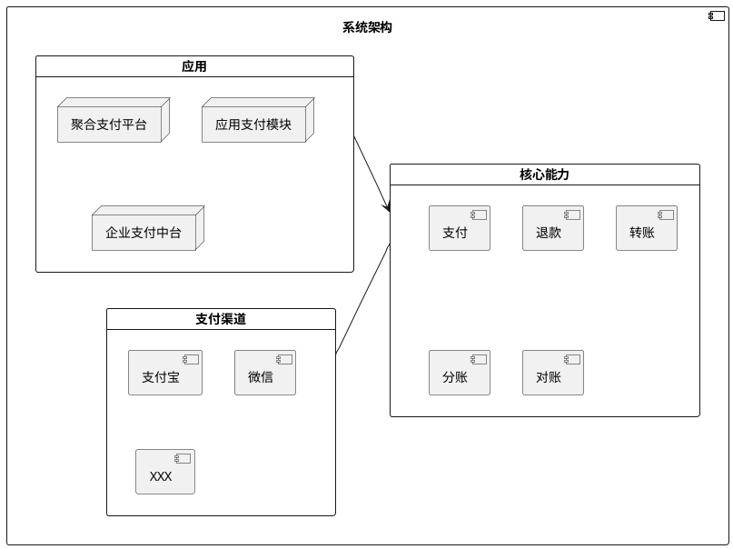
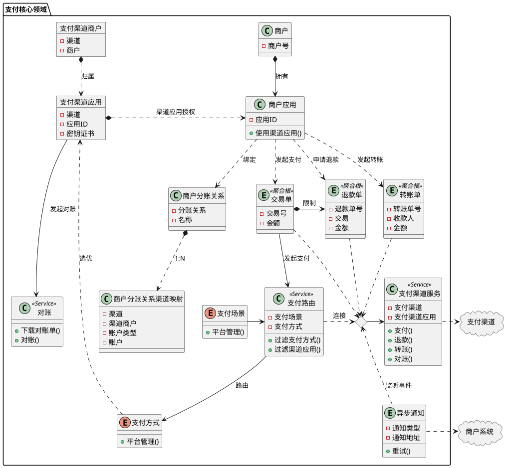

# 支付

## 概述

支付系统是一个用于处理各种支付和转账操作的核心平台，旨在为商户提供高效、安全、可靠的支付解决方案。该系统支持多种支付渠道，并具备灵活的业务处理能力，以满足不同场景下的支付需求。

## 目标

- **通用的支付组件** 能为企业、应用提供支付能力的基础设施组件，为上层应用快速的集成支付能力
- **支付中台** 能够将支付渠道与商户应用进行关联，为企业业务提供整体支付能力

## 统一语言表

|    术语    |       英文       | 描述                                               |
|:--------:|:--------------:|--------------------------------------------------|
|  **商户**  |    Merchant    | 在支付系统下创建的独立权限的用户                                 |
| **商户应用** |  MerchantApp   | 商户创建的应用                                          |
| **渠道应用** |   ChannelApp   | 在支付渠道下一个商户创建的一个支付应用，主要和支付渠道交互                    |
|  **交易**  |     Trans      | 商户发起的支付收单                                        |
|  **退款**  |     Refund     | 支付渠道发起的支付收单                                      |
|  **转账**  |    Transfer    | 商户发起的使用支付渠道的商户余额向指定收款人、金额的转账                     |
| **支付渠道** |    Channel     | 支付系统的支付渠道，如各大银行、微信、支付宝、银联、翼支付等。支付渠道有收单和退款能力      |
| **支付方式** |     Method     | 支付渠道支持的支付方式，如微信、支付宝、银行卡等                         |
| **支付场景** |  PaymentScene  | 用户在支付流程中使用的支付场景，如APP、PC、小程序、H5、APP-NATIVE等       |
| **支付路由** | PaymentRouting | 用户在发起支付时，支付系统根据用户选择的支付场景，选择合适的支付渠道和支付方式，最终发起支付请求 |
|  **对账**  | Reconciliation | 支付系统对支付渠道发起的支付请求，支付渠道返回的支付结果，支付系统对支付结果的处理，最终对账   |

## 系统架构

## 核心模型

- 支付渠道应用 可以由管理员创建，授权给商户商用、也可以由商户创建，授权给商户商用。具体逻辑可以由上层应用来决定。支付领域模型中，只做支付渠道应用授权给商户使用
- 所有的商户应用继承了商户的所有支付渠道应用权限

## 边界上下文
