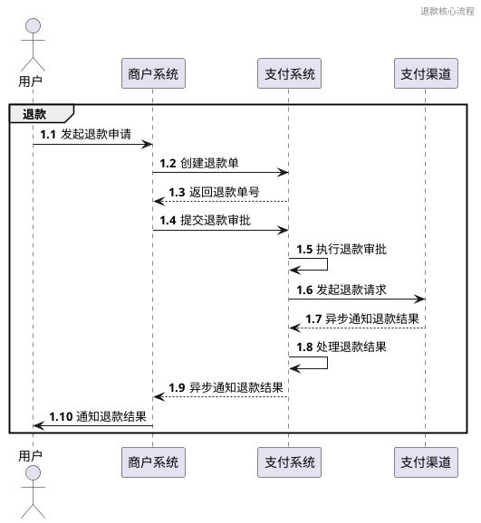
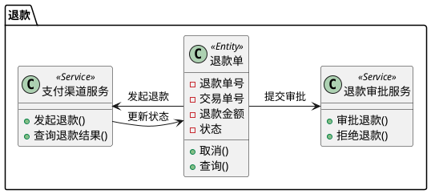

# 退款

## 背景介绍
退款模块是支付系统的重要组成部分，负责处理交易退款请求，管理退款状态，并与支付渠道进行交互。该模块支持全额退款和部分退款，确保资金能够安全、及时地退还给用户。

## 目标

### 业务目标
- **提升退款处理效率**：优化退款流程，缩短退款处理时间
- **保障资金安全**：通过多重验证机制确保退款操作的安全性
- **提高用户体验**：提供透明的退款进度查询功能

### 技术目标
- **高可靠性**：确保退款操作的事务一致性
- **可追溯性**：完整记录退款操作日志
- **可扩展性**：支持未来新增退款规则和策略

## 领域分析

### 业务场景

#### 核心流程

## 领域建模

### 领域模型

### 领域事件

- **退款申请事件**：当用户发起退款申请时触发
- **退款审批通过事件**：当退款申请被审批通过时触发
- **退款审批拒绝事件**：当退款申请被拒绝时触发
- **退款发起事件**：当退款请求被发起时触发
- **退款成功事件**：当退款成功完成时触发
- **退款失败事件**：当退款失败时触发
- **退款关闭事件**：当退款被取消或关闭时触发

## 战略设计

### 子领域划分
- **核心子领域**：退款处理
- **支持子领域**：退款审批、退款对账
- **通用子领域**：日志记录、监控报警

### 限界上下文
- **退款上下文**：处理退款创建、审批、执行等核心业务
- **审批上下文**：管理退款审批流程
- **对账上下文**：处理退款对账和异常处理

## 战术设计

### 实体
- **退款单**：核心实体，记录退款信息
- **交易单**：关联的交易信息

### 值对象
- **退款金额**：退款金额信息
- **退款结果**：退款结果信息

### 领域服务
- **支付渠道服务**：与支付渠道交互处理退款
- **退款审批服务**：处理退款审批流程

### 仓库
- **退款仓库**：退款单的持久化和查询
- **交易仓库**：关联交易单的查询

### 异常
- **退款失败异常**：退款失败时抛出
- **审批拒绝异常**：退款审批被拒绝时抛出
- **余额不足异常**：账户余额不足时抛出
