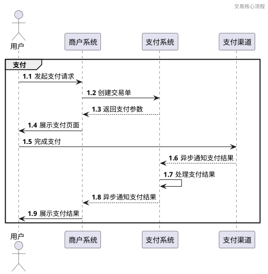
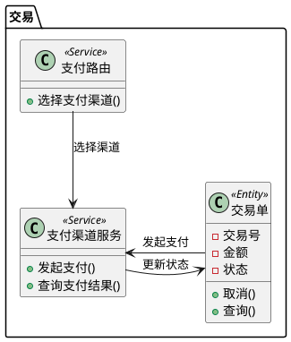

# 交易

## 背景介绍
交易模块是支付系统的核心功能之一，负责处理支付请求、管理交易状态以及与支付渠道的交互。该模块支持多种支付方式，包括但不限于微信支付、支付宝、银行卡支付等。

## 目标

### 业务目标
- **提升支付成功率**：优化支付流程，减少支付失败率
- **增强安全性**：通过多重验证机制保障交易安全
- **提高处理效率**：支持高并发交易处理

### 技术目标
- **高可用性**：确保交易系统7x24小时稳定运行
- **可扩展性**：支持未来新增支付渠道和支付方式
- **可监控性**：提供完善的交易监控和报警机制

## 领域分析

### 业务场景

#### 核心流程

## 领域建模

### 领域模型

### 领域事件

- **交易创建事件**：当一个新的交易单被创建时触发
- **支付发起事件**：当支付请求被发起时触发
- **支付成功事件**：当支付成功完成时触发
- **支付失败事件**：当支付失败时触发
- **交易关闭事件**：当交易被取消或关闭时触发
- **交易超时事件**：当交易超过规定时间未完成时触发

## 战略设计

### 子领域划分
- **核心子领域**：交易处理
- **支持子领域**：支付渠道管理、交易对账
- **通用子领域**：日志记录、监控报警

### 限界上下文
- **交易上下文**：处理交易创建、支付、查询等核心业务
- **支付渠道上下文**：管理支付渠道配置和路由
- **对账上下文**：处理交易对账和异常处理

## 战术设计

### 实体
- **交易单**：核心实体，记录交易信息
- **支付渠道**：支付渠道配置信息

### 值对象
- **支付参数**：支付请求所需参数
- **支付结果**：支付结果信息

### 领域服务
- **支付渠道服务**：与支付渠道交互
- **支付路由服务**：选择最优支付渠道

### 仓库
- **交易仓库**：交易单的持久化和查询
- **支付渠道仓库**：支付渠道配置管理

### 异常
- **支付失败异常**：支付失败时抛出
- **渠道不可用异常**：支付渠道不可用时抛出
