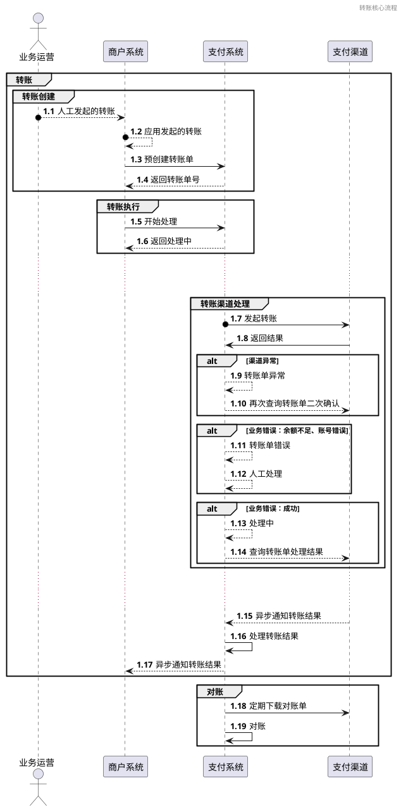
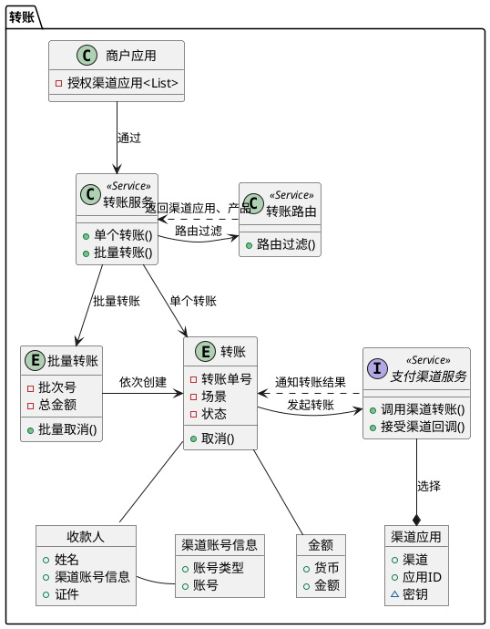

# 转账

## 背景介绍

转账模块是支付系统的核心功能之一，旨在为商户提供高效、安全的转账服务。该模块支持单笔转账和批量转账，并且所有转账操作需要经过严格的审批流程，确保每笔交易合法合规。

## 目标

### 业务目标

- **提升用户体验**：简化转账流程，确保用户能够快速、便捷地完成转账。
- **增强安全性**：通过多层安全机制保障转账过程中的资金安全和个人信息安全。
- **提高效率**：优化系统性能，减少转账处理时间，提高交易成功率。

### 技术目标

- **高可用性**：确保系统7x24小时稳定运行，具备容灾备份能力。
- **可扩展性**：支持未来业务增长和技术升级，能够轻松集成新的支付渠道和服务。
- **合规性**：遵循国内外支付行业的法律法规和标准规范（如 PCI-DSS、GDPR）。

## 领域分析

### 业务场景

#### 核心流程

## 渠道返回结果

| 异常类型 |               返回形式                |            说明            |
|------|:---------------------------------:|:------------------------:|
| 渠道异常 | throw new ChannelGatewayException |   渠道调用不成功，如:请求异常、请求失败    |
| 业务错误 |    返回Result.successFul = false    | 业务逻辑错误，如：渠道应用类型错误、单据数据错误 |
| 业务成功 |    返回Result.successFul = true     |          业务调用成功          |

- **单笔转账**
	- 商户在知道账号、姓名、金额、渠道、应用ID的情况下，向收款人转账。

- **批量转账**
	- 商户可以一次性提交多个转账请求，系统将依次创建并处理这些请求。

- **分步提交**
  - 

## 领域建模

### 领域模型

- 支付渠道服务：根据不同的渠道，通过工厂创建渠道服务，负责与支付渠道进行交互，包括调用渠道转账和接受渠道回调。具体实现方式在基础设施层中完成。
- 转账场景: 对于各个渠道的场景不一致，支付领域需要抽象出内部的转账场景，通过枚举类型实现，各个渠道服务进行匹配。

### 领域事件

- **转账创建事件**：当一个新的转账单被创建时触发。
- **转账执行事件**：当转账请求通过审批后触发。
- **转账成功事件**：当转账成功完成后触发。
- **转账失败事件**：当转账失败时触发。
- **对账取消事件**：当对账流程完成后触发。

### 领域模型状态追踪

## 战略设计

### 子领域划分

- **核心子领域**：
	- **转账管理**：负责处理单笔和批量转账的业务逻辑。

- **支持子领域**：
	- **账户管理**：处理账户创建、查询、冻结等功能。
	- **审批管理**：实现转账请求的审批流程。
	- **对账与结算**：定期与合作机构进行账目核对，确保数据一致性。

- **通用子领域**：
	- **用户认证**：负责用户身份验证。
	- **日志记录**：记录系统操作日志。

### 限界上下文

- **转账上下文**：
	- 包含所有与转账相关的业务逻辑和数据模型。

- **账户管理上下文**：
	- 处理账户创建、查询、冻结等功能。

- **审批上下文**：
	- 负责处理转账请求的审批流程。

- **对账上下文**：
	- 定期与合作机构进行账目核对，确保数据一致性。

### 上下文映射

- **转账上下文**与**账户管理上下文**之间通过共享内核模式（Shared Kernel）进行交互。
- **转账上下文**与**审批上下文**之间通过发布/订阅模式（Publish-Subscribe）进行事件驱动的通信。
- **转账上下文**与**对账上下文**之间通过异步消息队列进行数据同步。

## 战术设计

### 实体

- **转账批次**：
	- 属性: 批次号、总金额、总笔数、状态(待审核、审核通过、审核拒绝、处理中、处理完成、处理失败)、创建时间、完成时间、备注
- **转账单**：
	- 属性：转账单号、收款人信息、付款人信息、转账金额、转账状态(待处理、处理中、成功、失败)、转账类型(实时转账、普通转账)
	  、转账用途、创建时间、完成时间、失败原因、备注

### 值对象

- **收款人**：
	- 属性：身份标识类型、身份标识、姓名、

- **金额**：
	- 属性：货币、金额

### 聚合

- **转账聚合**：
	- 由 `转账` 和关联的 `收款人`、`金额` 组成。

- **批量转账聚合**：
	- 由 `批量转账` 和多个 `转账` 组成。

### 领域服务

- **支付渠道服务**：
	- 方法：调用渠道转账()、接受渠道回调()

- **审批服务**：
	- 方法：处理审批请求、返回审批结果

### 仓库

- **转账仓库**：
	- 提供持久化和检索 `转账` 实体的功能。

- **批量转账仓库**：
	- 提供持久化和检索 `批量转账` 实体的功能。

### 工厂

- **转账工厂**：
	- 创建新的 `转账` 实例。

- **批量转账工厂**：
	- 创建新的 `批量转账` 实例。

### 异常

- **转账失败异常**：
	- 当转账过程中出现错误时抛出。

- **审批失败异常**：
	- 当审批流程未通过时抛出。

- **对账失败异常**：
	- 当对账过程中发现不一致时抛出。

