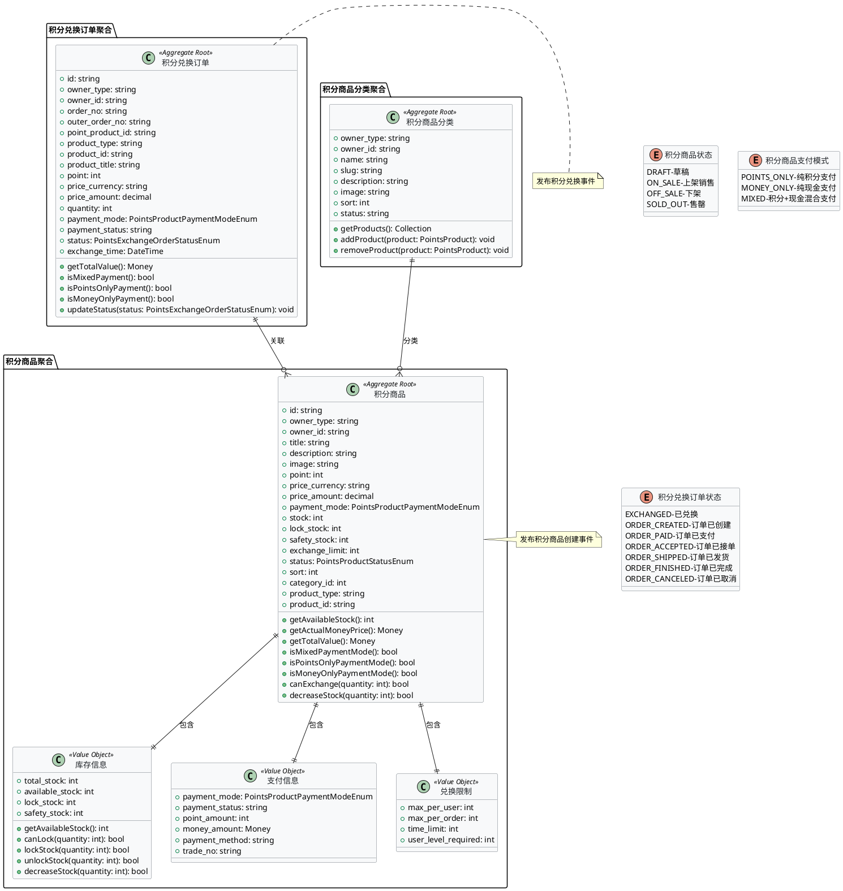
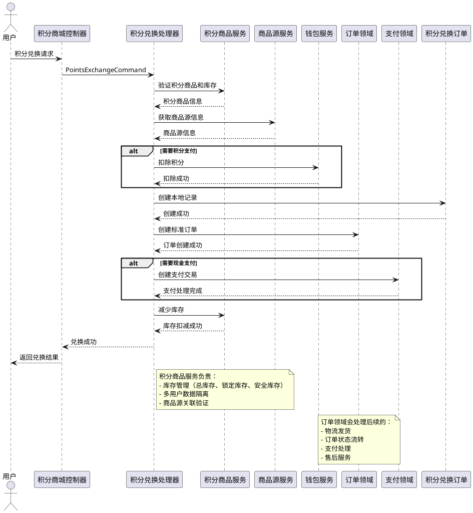
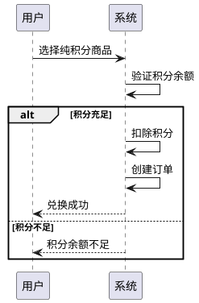
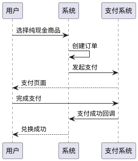
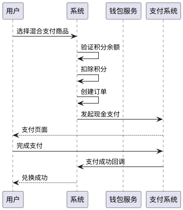
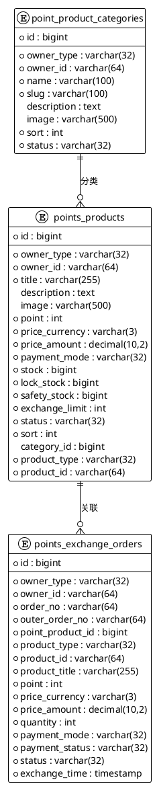

# 积分商城领域设计方案

## 引言

### 背景介绍
积分商城是一个独立的领域，主要负责积分商品管理、积分兑换订单处理和积分余额管理。它与商品领域、订单领域、钱包领域进行集成，提供完整的积分兑换服务。系统支持多用户使用，通过 `owner_type` 和 `owner_id` 字段区分不同用户的积分商品和订单。

### 问题域
积分商城领域需要解决以下核心问题：

- **[积分商品管理]**：如何有效管理积分商品的发布、上下架、库存等，支持多用户独立管理
- **[商品源关联]**：如何将积分商品关联到商品领域的商品ID，实现商品信息复用
- **[库存控制]**：如何实现积分商品内部独立控制库存，包括锁定库存和安全库存机制
- **[积分兑换处理]**：如何处理用户的积分兑换请求，支持多种支付模式
- **[订单集成]**：如何与订单领域集成，统一处理订单流程
- **[积分管理]**：如何与钱包领域集成，管理用户积分余额
- **[支付处理]**：如何支持纯积分、纯现金、积分+现金混合支付模式

### 业务价值
积分商城领域为业务带来以下价值：

- **[提升用户活跃度]**：通过积分兑换增加用户粘性，提高用户活跃度
- **[多用户独立运营]**：支持多用户独立运营，满足不同商家的积分商城需求
- **[多样化支付方式]**：提供多样化的支付方式，满足不同用户需求
- **[系统无缝集成]**：与现有系统无缝集成，复用订单和支付流程
- **[灵活商品配置]**：支持灵活的积分商品配置，满足业务需求
- **[商品信息复用]**：通过商品源关联，实现商品信息的统一管理和复用

### 项目目标
- **业务目标**：
  - 建立完整的积分兑换体系，提升用户参与度和忠诚度
  - 支持多用户独立运营积分商城，满足不同商家需求
  - 提供多样化的支付方式，满足不同用户场景
  - 与现有系统无缝集成，复用成熟的订单和支付流程

- **技术目标**：
  - 采用DDD架构，提升系统可维护性和扩展性
  - 实现高并发、高可用的积分兑换系统
  - 建立完善的监控和告警体系
  - 支持多用户数据隔离和权限控制

### 适用范围
本领域设计方案适用于积分商城的设计、开发、测试和运维团队，涵盖领域建模、架构设计、开发规范等各个方面。

## 统一语言表

| 英文名称 | 中文名称 | 说明 | 示例 |
|---------|---------|------|------|
| PointsProduct | 积分商品 | 可以用积分兑换的商品 | 积分商城中的商品 |
| PointsExchangeOrder | 积分兑换订单 | 用户积分兑换的记录 | 用户的兑换订单 |
| PointProductCategory | 积分商品分类 | 积分商品的分类管理 | 数码产品、服装、食品等分类 |
| PointsProductPaymentMode | 积分商品支付模式 | 商品的支付方式配置 | 纯积分、纯现金、混合支付 |
| PointsExchangeOrderStatus | 积分兑换订单状态 | 兑换订单的状态流转 | 已兑换、已支付、已完成 |
| ProductType | 商品源类型 | 积分商品关联的商品源类型 | product、service、virtual |
| ProductId | 商品源ID | 积分商品关联的商品源ID | 关联到商品领域的商品ID |
| Stock | 库存 | 积分商品的可用库存数量 | 100件商品 |
| LockStock | 锁定库存 | 已下单但未支付的库存数量 | 10件锁定库存 |
| SafetyStock | 安全库存 | 防止超卖的安全库存数量 | 5件安全库存 |
| ExchangeLimit | 兑换限制 | 商品兑换的限制条件 | 每人限购数量 |
| PaymentInfo | 支付信息 | 支付相关的详细信息 | 支付方式、金额、交易号 |
| StockInfo | 库存信息 | 商品的库存相关信息 | 总库存、可用库存、锁定库存 |
| OwnerType | 所属者类型 | 数据所属者的类型 | user、shop、admin |
| OwnerId | 所属者ID | 数据所属者的ID | 用户ID、商家ID |
| OuterOrderNo | 关联订单号 | 关联到订单领域的订单号 | 标准订单的订单号 |

## 战略设计

### 子域划分
- **核心子域**：积分商品管理、积分兑换处理、积分兑换订单管理
- **支撑子域**：积分商品分类管理、库存管理、支付处理
- **通用子域**：用户管理、商品源关联、订单集成

### 限界上下文
- **[积分商城上下文]**：负责积分商品管理、积分兑换、订单处理等核心功能
- **[商品源上下文]**：负责与商品领域的商品源关联和信息同步
- **[支付上下文]**：负责积分和现金支付的处理
- **[订单上下文]**：负责与订单领域的集成和状态同步

### 上下文映射
- **[积分商城上下文]** ↔ **[商品源上下文]**：共享内核关系，积分商品关联商品源
- **[积分商城上下文]** ↔ **[支付上下文]**：客户-供应商关系，积分商城使用支付服务
- **[积分商城上下文]** ↔ **[订单上下文]**：客户-供应商关系，积分商城创建订单

### 领域分析
积分商城的核心业务流程包括：

#### UC001：积分兑换流程
**参与者**：用户、积分商城系统、钱包系统、订单系统
**前置条件**：用户已登录，积分商品已上架，用户有足够积分
**主流程**：
1. 用户选择积分商品并提交兑换请求
2. 系统验证商品状态和用户积分余额
3. 系统扣除用户积分并创建兑换记录
4. 系统创建标准订单并关联到兑换记录
5. 系统处理现金支付部分（如需要）
6. 系统更新商品库存
7. 系统返回兑换结果
**后置条件**：兑换订单创建成功，积分已扣除，库存已更新

#### UC002：积分商品管理流程
**参与者**：商家、积分商城系统、商品源系统
**前置条件**：商家已登录，商品源已存在
**主流程**：
1. 商家选择商品源并配置积分商品信息
2. 系统验证商品源的有效性
3. 系统创建积分商品记录
4. 系统设置库存和支付模式
5. 系统发布积分商品
**后置条件**：积分商品创建成功并上架销售

### 核心能力

#### 积分商品管理能力
- **[商品发布]**：支持积分商品的发布、编辑、上下架管理
- **[库存控制]**：支持库存管理，包括锁定库存和安全库存机制
- **[分类管理]**：支持积分商品的分类管理和展示
- **[商品源关联]**：支持与商品领域的商品源关联和信息同步

#### 积分兑换能力
- **[兑换处理]**：支持用户积分兑换请求的处理
- **[支付模式]**：支持纯积分、纯现金、积分+现金混合支付模式
- **[兑换限制]**：支持兑换数量限制和用户限制
- **[订单集成]**：支持与订单领域的集成和状态同步

#### 积分管理能力
- **[积分扣除]**：支持用户积分的扣除和余额验证
- **[交易记录]**：支持积分交易记录的创建和管理
- **[余额管理]**：支持用户积分余额的查询和管理
- **[钱包集成]**：支持与钱包领域的集成

### 领域参与角色

#### 内部角色
- **[积分商品管理员]**：负责积分商品的创建、编辑、上下架管理
- **[积分兑换处理员]**：负责积分兑换订单的处理和状态管理
- **[库存管理员]**：负责积分商品库存的管理和监控
- **[分类管理员]**：负责积分商品分类的管理
- **[系统管理员]**：负责积分商城系统的配置和维护

#### 外部角色
- **[用户]**：进行积分兑换操作，查看积分商品
- **[商家]**：管理自己的积分商品和分类
- **[商品源管理员]**：管理商品源信息
- **[钱包管理员]**：管理用户积分余额
- **[订单管理员]**：处理标准订单流程

### 连接领域

#### 上游领域
- **[商品领域]**：提供商品源信息，积分商品关联商品源
- **[用户领域]**：提供用户信息和权限验证
- **[钱包领域]**：提供积分余额管理和交易记录
- **[支付领域]**：提供支付处理和交易管理

#### 下游领域
- **[订单领域]**：接收积分兑换订单，处理后续订单流程
- **[物流领域]**：处理积分兑换商品的物流配送
- **[通知领域]**：发送积分兑换相关的通知消息
- **[统计领域]**：提供积分兑换相关的统计数据

## 领域层设计

### 领域模型



### 领域事件

#### 核心事件
- **[积分商品创建事件]**：积分商品创建时触发，通知相关系统
- **[积分兑换事件]**：积分兑换成功时触发，通知订单和支付系统
- **[库存变更事件]**：库存发生变化时触发，通知相关系统
- **[订单状态变更事件]**：订单状态发生变化时触发，同步状态

#### 事件处理
- **[积分商品创建事件]**：由商品源同步处理器处理，同步商品源信息
- **[积分兑换事件]**：由订单创建处理器处理，创建标准订单
- **[库存变更事件]**：由库存监控处理器处理，检查库存预警
- **[订单状态变更事件]**：由状态同步处理器处理，同步订单状态

### 实体设计
- **[积分商品]**：聚合根，负责积分商品的基本信息管理和库存控制
- **[积分兑换订单]**：聚合根，负责积分兑换的完整流程管理
- **[积分商品分类]**：聚合根，负责积分商品的分类管理

### 值对象设计
- **[库存信息]**：封装库存相关的业务逻辑，包括可用库存计算、库存锁定等
- **[支付信息]**：封装支付相关的业务逻辑，包括支付模式、支付状态等
- **[兑换限制]**：封装兑换限制的业务逻辑，包括用户限制、数量限制等

### 领域服务
- **[积分兑换服务]**：处理积分兑换的核心业务逻辑
- **[库存管理服务]**：处理库存管理的业务逻辑
- **[支付处理服务]**：处理支付相关的业务逻辑

### 业务规则设计

#### 核心业务规则
- **[积分余额验证规则]**：兑换前必须验证用户积分余额是否充足
- **[库存验证规则]**：兑换前必须验证商品库存是否充足
- **[兑换限制规则]**：必须验证兑换限制条件，如每人限购数量
- **[支付模式规则]**：根据商品配置的支付模式处理支付逻辑

#### 验证规则
- **[商品状态验证]**：只能兑换上架状态的商品
- **[用户权限验证]**：验证用户是否有权限进行兑换
- **[商品源验证]**：验证关联的商品源是否有效
- **[支付金额验证]**：验证支付金额是否符合商品定价

#### 业务约束
- **[库存约束]**：库存不足时不能兑换
- **[积分约束]**：积分不足时不能兑换
- **[时间约束]**：商品不在销售时间内不能兑换
- **[用户约束]**：用户不满足兑换条件时不能兑换

### 仓库接口
- **[积分商品仓库]**：负责积分商品的持久化和检索
- **[积分兑换订单仓库]**：负责积分兑换订单的持久化和检索
- **[积分商品分类仓库]**：负责积分商品分类的持久化和检索

### 工厂模式
- **[积分商品工厂]**：创建积分商品对象，处理复杂的创建逻辑
- **[积分兑换订单工厂]**：创建积分兑换订单对象，设置初始状态
- **[积分商品分类工厂]**：创建积分商品分类对象，处理分类创建逻辑

### 业务异常分类
- **验证异常**：输入参数验证失败，如积分不足、库存不足
- **业务异常**：业务规则违反，如兑换限制、商品状态异常
- **系统异常**：系统内部错误，如数据库连接失败
- **外部异常**：第三方服务调用失败，如钱包服务、订单服务

## 应用层设计

### 应用服务

#### 积分商城应用服务 (PointsMallApplicationService)
**功能描述**：积分商城领域的核心应用服务，负责积分商品管理、积分兑换处理等业务逻辑
**核心方法**：
- `exchange()` - 处理积分兑换
- `checkExchange()` - 检查兑换资格
- `listProducts()` - 分页查询积分商品
- `getProduct()` - 查询单个积分商品
- `createProduct()` - 创建积分商品
- `updateProduct()` - 更新积分商品
- `deleteProduct()` - 删除积分商品

#### 积分兑换应用服务 (PointsExchangeApplicationService)
**功能描述**：专门处理积分兑换相关的业务逻辑
**核心方法**：
- `processExchange()` - 处理积分兑换流程
- `validateExchange()` - 验证兑换资格
- `createOrder()` - 创建兑换订单
- `updateOrderStatus()` - 更新订单状态

### 命令设计

#### 基础命令
- **PointsProductCreateCommand** - 创建积分商品命令
- **PointsProductUpdateCommand** - 更新积分商品命令
- **PointsProductDeleteCommand** - 删除积分商品命令

#### 业务命令
- **PointsExchangeCommand** - 积分兑换命令
- **PointsCheckExchangeCommand** - 检查兑换资格命令
- **PointsOrderCreateCommand** - 创建兑换订单命令
- **PointsOrderStatusUpdateCommand** - 更新订单状态命令

### 查询设计

#### 基础查询
- **PointsProductFindQuery** - 查询单个积分商品
- **PointsProductPaginateQuery** - 分页查询积分商品列表

#### 业务查询
- **PointsExchangeOrderQuery** - 积分兑换订单查询
- **PointsProductByCategoryQuery** - 按分类查询积分商品
- **PointsExchangeStatisticsQuery** - 积分兑换统计查询

### 命令处理器

#### 基础处理器
- **PointsProductCreateCommandHandler** - 处理创建积分商品命令
- **PointsProductUpdateCommandHandler** - 处理更新积分商品命令
- **PointsProductDeleteCommandHandler** - 处理删除积分商品命令

#### 业务处理器
- **PointsExchangeCommandHandler** - 处理积分兑换命令
- **PointsCheckExchangeCommandHandler** - 处理检查兑换资格命令
- **PointsOrderCreateCommandHandler** - 处理创建兑换订单命令
- **PointsOrderStatusUpdateCommandHandler** - 处理更新订单状态命令

### 查询处理器

#### 基础处理器
- **PointsProductFindQueryHandler** - 处理查询单个积分商品
- **PointsProductPaginateQueryHandler** - 处理分页查询积分商品列表

#### 业务处理器
- **PointsExchangeOrderQueryHandler** - 处理积分兑换订单查询
- **PointsProductByCategoryQueryHandler** - 处理按分类查询积分商品
- **PointsExchangeStatisticsQueryHandler** - 处理积分兑换统计查询

### 转换器
- **PointsProductTransformer** - 负责将DTO数据映射到积分商品模型
- **PointsExchangeOrderTransformer** - 负责将DTO数据映射到积分兑换订单模型
- **PointProductCategoryTransformer** - 负责将DTO数据映射到积分商品分类模型

## 基础设施层设计

### 仓库实现

#### 积分商品仓库 (PointsProductRepository)
**功能描述**：积分商品写操作仓库，负责积分商品的持久化操作
**核心方法**：
- `find($id)` - 根据ID查找积分商品
- `store($model)` - 保存积分商品
- `update($model)` - 更新积分商品
- `delete($model)` - 删除积分商品
- `decreaseStock($productId, $quantity)` - 减少库存
- `findOnSale()` - 查找上架商品

#### 积分商品只读仓库 (PointsProductReadRepository)
**功能描述**：积分商品只读仓库，负责积分商品的查询操作
**核心方法**：
- `paginate($query)` - 分页查询积分商品
- `find($query)` - 查询单个积分商品
- `withQuery($callback)` - 设置查询作用域
- `findWithCategory($productId)` - 查询商品及其分类
- `findOnSaleByCategory($categoryId)` - 按分类查询上架商品

#### 积分兑换订单仓库 (PointsExchangeOrderRepository)
**功能描述**：积分兑换订单写操作仓库，负责订单的持久化操作
**核心方法**：
- `find($id)` - 根据ID查找订单
- `store($model)` - 保存订单
- `update($model)` - 更新订单
- `delete($model)` - 删除订单
- `findByOrderNo($orderNo)` - 根据订单号查找

#### 积分兑换订单只读仓库 (PointsExchangeOrderReadRepository)
**功能描述**：积分兑换订单只读仓库，负责订单的查询操作
**核心方法**：
- `paginate($query)` - 分页查询订单
- `find($query)` - 查询单个订单
- `withQuery($callback)` - 设置查询作用域
- `findByBuyer($buyer)` - 查询用户的订单
- `countByBuyerAndProduct($buyer, $productId)` - 统计用户兑换次数

### 过滤器配置

#### 积分商品过滤器
**允许的过滤器**：
- `title` - 商品标题模糊匹配
- `id` - 商品ID精确匹配
- `category_id` - 分类ID精确匹配
- `status` - 商品状态精确匹配
- `payment_mode` - 支付模式精确匹配
- `owner_type` - 所属者类型精确匹配
- `owner_id` - 所属者ID精确匹配

**允许的排序**：
- `id` - 按ID排序
- `title` - 按标题排序
- `created_at` - 按创建时间排序
- `updated_at` - 按更新时间排序
- `sort` - 按排序字段排序
- `point` - 按积分价格排序

**允许的关联**：
- `category` - 包含分类信息
- `productSource` - 包含商品源信息

#### 积分兑换订单过滤器
**允许的过滤器**：
- `order_no` - 订单号精确匹配
- `point_product_id` - 积分商品ID精确匹配
- `status` - 订单状态精确匹配
- `payment_mode` - 支付模式精确匹配
- `owner_type` - 所属者类型精确匹配
- `owner_id` - 所属者ID精确匹配

**允许的排序**：
- `id` - 按ID排序
- `order_no` - 按订单号排序
- `created_at` - 按创建时间排序
- `updated_at` - 按更新时间排序
- `exchange_time` - 按兑换时间排序

**允许的关联**：
- `pointProduct` - 包含积分商品信息
- `productSource` - 包含商品源信息

### 外部服务集成

#### 商品服务集成 (ProductServiceIntegration)
- 商品信息查询
- 库存管理
- 商品状态校验

#### 钱包服务集成 (WalletServiceIntegration)
- 积分余额查询
- 积分扣除
- 积分交易记录

#### 订单服务集成 (OrderServiceIntegration)
- 订单创建
- 订单状态管理
- 订单流程控制

#### 支付服务集成 (PaymentServiceIntegration)
- 支付交易创建
- 支付状态管理
- 支付方式支持

## 用户接口层设计

### 控制器

#### 积分商城控制器 (PointsMallController)
**功能描述**：积分商城的主要控制器，负责积分商品的展示和兑换操作
**核心接口**：
- `index()` - 获取积分商品列表
- `show($id)` - 获取积分商品详情
- `exchange()` - 积分兑换
- `checkExchange()` - 检查兑换资格
- `productsByCategory($categoryId)` - 按分类获取商品

#### 积分兑换订单控制器 (PointsExchangeOrderController)
**功能描述**：积分兑换订单控制器，负责订单的查询和管理
**核心接口**：
- `index()` - 获取订单列表
- `show($id)` - 获取订单详情
- `statistics()` - 获取订单统计信息

### API资源

#### 积分商品资源 (PointsProductResource)
**功能描述**：积分商品的API资源转换
**核心字段**：
- `id` - 积分商品ID
- `title` - 商品标题
- `description` - 商品描述
- `image` - 商品图片
- `point` - 积分价格
- `price_amount` - 现金价格
- `payment_mode` - 支付模式
- `stock` - 库存信息
- `category` - 分类信息
- `product_source` - 商品源信息

#### 积分兑换订单资源 (PointsExchangeOrderResource)
**功能描述**：积分兑换订单的API资源转换
**核心字段**：
- `id` - 订单ID
- `order_no` - 订单号
- `outer_order_no` - 关联订单号
- `product_title` - 商品标题
- `point` - 积分数量
- `price_amount` - 现金金额
- `quantity` - 数量
- `payment_mode` - 支付模式
- `status` - 订单状态
- `exchange_time` - 兑换时间

### 请求验证

#### 积分兑换请求验证 (PointsExchangeRequest)
**功能描述**：积分兑换请求的数据验证
**验证规则**：
- `product_id` - 商品ID必填
- `quantity` - 数量必填且大于0
- `cash_amount` - 现金金额可选且大于等于0
- `payment_method` - 支付方式可选
- `buyer_remarks` - 买家备注可选
- `address` - 收货地址可选

#### 积分商品创建请求验证 (PointsProductCreateRequest)
**功能描述**：积分商品创建请求的数据验证
**验证规则**：
- `title` - 商品标题必填且最大255字符
- `description` - 商品描述可选
- `point` - 积分价格必填且大于等于0
- `price_amount` - 现金价格必填且大于等于0
- `payment_mode` - 支付模式必填
- `stock` - 库存必填且大于等于0
- `category_id` - 分类ID可选

### 路由定义

#### API路由
```php
Route::group(['prefix' => 'points-mall'], function () {
    // 商品相关
    Route::get('products', [PointsMallController::class, 'index']);
    Route::get('products/{id}', [PointsMallController::class, 'show']);
    Route::get('products/category/{categoryId}', [PointsMallController::class, 'productsByCategory']);
    Route::get('products/search', [PointsMallController::class, 'search']);
    
    // 兑换相关
    Route::post('exchange', [PointsMallController::class, 'exchange']);
    Route::post('check-exchange', [PointsMallController::class, 'checkExchange']);
    
    // 订单相关
    Route::get('orders', [PointsExchangeOrderController::class, 'index']);
    Route::get('orders/{id}', [PointsExchangeOrderController::class, 'show']);
    Route::get('orders/statistics', [PointsExchangeOrderController::class, 'statistics']);
});
```

#### Web路由
```php
Route::group(['prefix' => 'points-mall'], function () {
    Route::get('products', [PointsMallController::class, 'index']);
    Route::get('products/{id}', [PointsMallController::class, 'show']);
    Route::get('orders', [PointsExchangeOrderController::class, 'index']);
});
```

## 7. 与现有领域集成

### 7.1 商品领域集成

- **商品源关联**：积分商品通过 `product_type` 和 `product_id` 关联到商品领域的商品
- **商品信息复用**：积分商品复用商品领域的基础信息，如商品标题、描述、图片等
- **独立库存管理**：积分商品独立管理库存，包括总库存、锁定库存、安全库存
- **分类体系**：积分商品使用独立的分类体系，支持多用户独立管理

### 7.2 订单领域集成

- **订单创建**：积分兑换订单推送到订单领域统一处理
- **状态同步**：通过事件监听器实现状态同步
- **流程复用**：复用订单领域的物流、支付、售后流程

### 7.3 钱包领域集成

- **积分管理**：直接使用钱包领域的积分钱包
- **交易记录**：复用钱包领域的交易记录机制
- **余额管理**：复用钱包领域的余额管理功能

### 7.4 支付领域集成

- **支付处理**：复用支付领域的支付处理机制
- **支付方式**：支持多种支付方式
- **支付状态**：复用支付领域的状态管理

## 8. 核心业务流程

### 8.1 积分兑换完整流程



### 8.2 支付模式处理流程

#### 纯积分支付模式



#### 纯现金支付模式



#### 混合支付模式



## 9. 配置设计

### 9.1 积分商城配置 (points-mall.php)

```php
return [
    'exchange' => [
        'min_points' => 1,                    // 最小兑换积分
        'max_points_per_order' => 10000,      // 单次最大兑换积分
        'exchange_limit_enabled' => true,      // 是否启用兑换限制
        'auto_confirm_timeout' => 24 * 60,    // 自动确认超时时间（分钟）
    ],
    
    'wallet' => [
        'type' => 'integral',                 // 积分钱包类型
        'currency' => 'ZJF',                  // 积分货币代码
    ],
    
    'order' => [
        'auto_create_logistics' => true,      // 是否自动创建物流订单
        'order_type' => 'points_exchange',    // 订单类型
        'currency' => 'CNY',                  // 现金部分使用人民币
        'payment_method' => 'mixed',          // 混合支付
    ],
    
    // 支付配置
    'payment' => [
        'merchant_app_id' => env('POINTS_MALL_MERCHANT_APP_ID'),
        'supported_methods' => [
            'wallet' => '钱包支付',
            'alipay' => '支付宝',
            'wechat' => '微信支付',
            'bank_card' => '银行卡',
        ],
        'default_method' => 'wallet',
    ],
    
    // 积分兑换比例配置
    'points_rate' => [
        'points_to_cny' => 0.01,              // 1积分 = 0.01元
        'cny_to_points' => 100,               // 1元 = 100积分
    ],
    
    // 订单状态同步配置
    'order_sync' => [
        'enabled' => true,
        'events' => [
            'created',
            'paid', 
            'accepted',
            'shipped',
            'finished',
            'canceled',
        ],
    ],
    
    // 多用户支持配置
    'multi_tenant' => [
        'enabled' => true,                    // 是否启用多用户支持
        'owner_types' => [                    // 支持的所属者类型
            'user' => '用户',
            'shop' => '商家',
            'admin' => '管理员',
        ],
        'data_isolation' => true,             // 是否启用数据隔离
    ],
    
    // 商品源配置
    'product_source' => [
        'enabled' => true,                    // 是否启用商品源关联
        'supported_types' => [                // 支持的商品源类型
            'product' => '商品',
            'service' => '服务',
            'virtual' => '虚拟商品',
        ],
        'auto_sync' => true,                  // 是否自动同步商品源信息
        'sync_fields' => [                    // 同步的字段
            'title',
            'description',
            'image',
        ],
    ],
    
    // 库存管理配置
    'stock' => [
        'enable_lock_stock' => true,          // 是否启用锁定库存
        'enable_safety_stock' => true,        // 是否启用安全库存
        'default_safety_stock' => 5,          // 默认安全库存
        'lock_timeout' => 30 * 60,            // 锁定库存超时时间（秒）
    ],
];
```

## 存储层设计

### 核心数据表

#### 积分商品表 (points_products)
```sql
-- 积分商品表
-- 表说明：存储积分商品的基本信息，包括商品标题、积分价格、现金价格、库存等
CREATE TABLE `points_products` (
  `id` bigint unsigned NOT NULL COMMENT '主键ID',
  `owner_type` varchar(32) NOT NULL COMMENT '所属者类型',
  `owner_id` varchar(64) NOT NULL COMMENT '所属者ID',
  `title` varchar(255) NOT NULL COMMENT '商品标题',
  `description` text COMMENT '商品描述',
  `image` varchar(500) DEFAULT NULL COMMENT '商品图片',
  `point` int NOT NULL DEFAULT '0' COMMENT '积分价格',
  `price_currency` varchar(3) NOT NULL DEFAULT 'CNY' COMMENT '价格货币',
  `price_amount` decimal(10,2) NOT NULL DEFAULT '0.00' COMMENT '价格金额',
  `payment_mode` varchar(32) NOT NULL DEFAULT 'points_only' COMMENT '支付模式',
  `stock` bigint NOT NULL DEFAULT '0' COMMENT '库存',
  `lock_stock` bigint NOT NULL DEFAULT '0' COMMENT '锁定库存',
  `safety_stock` bigint unsigned NOT NULL DEFAULT '0' COMMENT '安全库存',
  `exchange_limit` int NOT NULL DEFAULT '0' COMMENT '兑换限制',
  `status` varchar(32) NOT NULL DEFAULT 'on_sale' COMMENT '状态',
  `sort` int NOT NULL DEFAULT '0' COMMENT '排序',
  `category_id` bigint unsigned DEFAULT NULL COMMENT '分类ID',
  `product_type` varchar(32) NOT NULL COMMENT '商品源类型',
  `product_id` varchar(64) NOT NULL COMMENT '商品源ID',
  `operator_type` varchar(32) DEFAULT NULL COMMENT '操作者类型',
  `operator_id` varchar(64) DEFAULT NULL COMMENT '操作者ID',
  `created_at` timestamp NULL DEFAULT NULL COMMENT '创建时间',
  `updated_at` timestamp NULL DEFAULT NULL COMMENT '更新时间',
  `deleted_at` timestamp NULL DEFAULT NULL COMMENT '删除时间',
  PRIMARY KEY (`id`),
  KEY `idx_status_sort` (`status`,`sort`),
  KEY `idx_category_id` (`category_id`),
  KEY `idx_payment_mode` (`payment_mode`),
  KEY `idx_owner` (`owner_type`,`owner_id`)
) ENGINE=InnoDB DEFAULT CHARSET=utf8mb4 COLLATE=utf8mb4_unicode_ci COMMENT='积分商品表';
```

#### 积分兑换订单表 (points_exchange_orders)
```sql
-- 积分兑换订单表
-- 表说明：存储积分兑换订单的完整信息，包括兑换商品、积分数量、现金金额等
CREATE TABLE `points_exchange_orders` (
  `id` bigint unsigned NOT NULL COMMENT '主键ID',
  `owner_type` varchar(32) NOT NULL COMMENT '所属者类型',
  `owner_id` varchar(64) NOT NULL COMMENT '所属者ID',
  `order_no` varchar(64) NOT NULL COMMENT '兑换订单号',
  `outer_order_no` varchar(64) NOT NULL COMMENT '关联订单号',
  `point_product_id` bigint unsigned NOT NULL COMMENT '积分商品ID',
  `product_type` varchar(32) NOT NULL COMMENT '商品源类型',
  `product_id` varchar(64) NOT NULL COMMENT '商品源ID',
  `product_title` varchar(255) NOT NULL COMMENT '商品标题',
  `point` int NOT NULL DEFAULT '0' COMMENT '积分',
  `price_currency` varchar(3) NOT NULL DEFAULT 'CNY' COMMENT '价格货币',
  `price_amount` decimal(10,2) NOT NULL DEFAULT '0.00' COMMENT '价格金额',
  `quantity` int NOT NULL DEFAULT '1' COMMENT '数量',
  `payment_mode` varchar(32) NOT NULL COMMENT '支付模式',
  `payment_status` varchar(32) NOT NULL COMMENT '支付状态',
  `status` varchar(32) NOT NULL DEFAULT 'exchanged' COMMENT '状态',
  `exchange_time` timestamp NOT NULL COMMENT '兑换时间',
  `operator_type` varchar(32) DEFAULT NULL COMMENT '操作者类型',
  `operator_id` varchar(64) DEFAULT NULL COMMENT '操作者ID',
  `created_at` timestamp NULL DEFAULT NULL COMMENT '创建时间',
  `updated_at` timestamp NULL DEFAULT NULL COMMENT '更新时间',
  `deleted_at` timestamp NULL DEFAULT NULL COMMENT '删除时间',
  PRIMARY KEY (`id`),
  UNIQUE KEY `uk_order_no` (`order_no`),
  KEY `idx_point_product_id` (`point_product_id`),
  KEY `idx_product_id` (`product_id`),
  KEY `idx_status` (`status`),
  KEY `idx_owner` (`owner_type`,`owner_id`)
) ENGINE=InnoDB DEFAULT CHARSET=utf8mb4 COLLATE=utf8mb4_unicode_ci COMMENT='积分兑换订单表';
```

#### 积分商品分类表 (point_product_categories)
```sql
-- 积分商品分类表
-- 表说明：存储积分商品的分类信息，支持多用户独立管理分类
CREATE TABLE `point_product_categories` (
  `id` bigint unsigned NOT NULL AUTO_INCREMENT COMMENT '主键ID',
  `owner_type` varchar(32) NOT NULL COMMENT '所属者类型',
  `owner_id` varchar(64) NOT NULL COMMENT '所属者ID',
  `name` varchar(100) NOT NULL COMMENT '分类名称',
  `slug` varchar(100) NOT NULL COMMENT '分类别名',
  `description` text COMMENT '分类描述',
  `image` varchar(500) DEFAULT NULL COMMENT '分类图片',
  `sort` int NOT NULL DEFAULT '0' COMMENT '排序',
  `status` varchar(32) NOT NULL DEFAULT 'enable' COMMENT '状态',
  `operator_type` varchar(32) DEFAULT NULL COMMENT '操作者类型',
  `operator_id` varchar(64) DEFAULT NULL COMMENT '操作者ID',
  `created_at` timestamp NULL DEFAULT NULL COMMENT '创建时间',
  `updated_at` timestamp NULL DEFAULT NULL COMMENT '更新时间',
  `deleted_at` timestamp NULL DEFAULT NULL COMMENT '删除时间',
  PRIMARY KEY (`id`),
  KEY `idx_owner` (`owner_type`,`owner_id`),
  KEY `idx_status_sort` (`status`,`sort`)
) ENGINE=InnoDB DEFAULT CHARSET=utf8mb4 COLLATE=utf8mb4_unicode_ci COMMENT='积分商品分类表';
```

### 数据关系图



## 配置设计

### 积分商城配置 (points-mall.php)

```php
return [
    'exchange' => [
        'min_points' => 1,                    // 最小兑换积分
        'max_points_per_order' => 10000,      // 单次最大兑换积分
        'exchange_limit_enabled' => true,      // 是否启用兑换限制
        'auto_confirm_timeout' => 24 * 60,    // 自动确认超时时间（分钟）
    ],
    
    'wallet' => [
        'type' => 'integral',                 // 积分钱包类型
        'currency' => 'ZJF',                  // 积分货币代码
    ],
    
    'order' => [
        'auto_create_logistics' => true,      // 是否自动创建物流订单
        'order_type' => 'points_exchange',    // 订单类型
        'currency' => 'CNY',                  // 现金部分使用人民币
        'payment_method' => 'mixed',          // 混合支付
    ],
    
    // 支付配置
    'payment' => [
        'merchant_app_id' => env('POINTS_MALL_MERCHANT_APP_ID'),
        'supported_methods' => [
            'wallet' => '钱包支付',
            'alipay' => '支付宝',
            'wechat' => '微信支付',
            'bank_card' => '银行卡',
        ],
        'default_method' => 'wallet',
    ],
    
    // 积分兑换比例配置
    'points_rate' => [
        'points_to_cny' => 0.01,              // 1积分 = 0.01元
        'cny_to_points' => 100,               // 1元 = 100积分
    ],
    
    // 订单状态同步配置
    'order_sync' => [
        'enabled' => true,
        'events' => [
            'created',
            'paid', 
            'accepted',
            'shipped',
            'finished',
            'canceled',
        ],
    ],
    
    // 多用户支持配置
    'multi_tenant' => [
        'enabled' => true,                    // 是否启用多用户支持
        'owner_types' => [                    // 支持的所属者类型
            'user' => '用户',
            'shop' => '商家',
            'admin' => '管理员',
        ],
        'data_isolation' => true,             // 是否启用数据隔离
    ],
    
    // 商品源配置
    'product_source' => [
        'enabled' => true,                    // 是否启用商品源关联
        'supported_types' => [                // 支持的商品源类型
            'product' => '商品',
            'service' => '服务',
            'virtual' => '虚拟商品',
        ],
        'auto_sync' => true,                  // 是否自动同步商品源信息
        'sync_fields' => [                    // 同步的字段
            'title',
            'description',
            'image',
        ],
    ],
    
    // 库存管理配置
    'stock' => [
        'enable_lock_stock' => true,          // 是否启用锁定库存
        'enable_safety_stock' => true,        // 是否启用安全库存
        'default_safety_stock' => 5,          // 默认安全库存
        'lock_timeout' => 30 * 60,            // 锁定库存超时时间（秒）
    ],
];
```

## 核心业务流程

### 积分兑换完整流程


### 支付模式处理流程

#### 纯积分支付模式


#### 纯现金支付模式


#### 混合支付模式


## 与现有领域集成

### 商品领域集成

- **商品源关联**：积分商品通过 `product_type` 和 `product_id` 关联到商品领域的商品
- **商品信息复用**：积分商品复用商品领域的基础信息，如商品标题、描述、图片等
- **独立库存管理**：积分商品独立管理库存，包括总库存、锁定库存、安全库存
- **分类体系**：积分商品使用独立的分类体系，支持多用户独立管理

### 订单领域集成

- **订单创建**：积分兑换订单推送到订单领域统一处理
- **状态同步**：通过事件监听器实现状态同步
- **流程复用**：复用订单领域的物流、支付、售后流程

### 钱包领域集成

- **积分管理**：直接使用钱包领域的积分钱包
- **交易记录**：复用钱包领域的交易记录机制
- **余额管理**：复用钱包领域的余额管理功能

### 支付领域集成

- **支付处理**：复用支付领域的支付处理机制
- **支付方式**：支持多种支付方式
- **支付状态**：复用支付领域的状态管理

## 监控和运维

### 关键指标

- 积分兑换成功率
- 积分兑换响应时间
- 积分余额使用率
- 积分商品转化率
- 混合支付使用率

### 日志记录

- 积分兑换操作日志
- 积分余额变动日志
- 订单状态同步日志
- 支付处理日志
- 异常处理日志

### 告警机制

- 积分余额不足告警
- 库存不足告警
- 支付失败告警
- 订单同步失败告警

## 扩展性设计

### 多用户支持扩展

- **多租户架构**：支持不同用户独立运营积分商城
- **数据隔离**：通过 `owner_type` 和 `owner_id` 实现数据隔离
- **权限控制**：支持不同用户角色的权限管理
- **独立配置**：每个用户可以有独立的积分商城配置

### 商品源扩展

- **商品源类型扩展**：支持更多商品源类型（product、service、virtual等）
- **商品源关联**：通过 `product_type` 和 `product_id` 关联不同领域的商品
- **商品信息同步**：支持从商品源自动同步商品信息
- **商品源验证**：支持商品源的有效性验证

### 库存管理扩展

- **库存策略**：支持不同的库存管理策略
- **库存预警**：支持库存不足预警机制
- **库存同步**：支持与商品源库存的同步
- **库存锁定**：支持订单锁定库存机制

### 支付模式扩展

- 支持更多支付方式
- 支持积分抵扣比例配置
- 支持阶梯定价
- 支持混合支付模式

### 营销功能扩展

- 积分商品促销
- 积分商品推荐
- 积分商品分类
- 积分商品收藏
- 积分商品评价
- 积分商品分享

## 安全设计

### 多用户数据安全

- **数据隔离**：通过 `owner_type` 和 `owner_id` 确保用户数据隔离
- **权限验证**：验证用户对数据的访问权限
- **跨用户访问防护**：防止用户访问其他用户的数据
- **数据加密**：敏感数据加密存储

### 业务安全

- **积分兑换频率限制**：防止恶意兑换
- **异常兑换行为检测**：检测异常兑换行为
- **防刷机制**：防止积分商城被恶意刷取
- **库存安全**：防止超卖和库存异常

### 系统安全

- **API接口权限控制**：基于用户角色的API权限控制
- **数据访问权限控制**：确保用户只能访问自己的数据
- **操作日志审计**：记录所有关键操作日志
- **商品源验证**：验证商品源的有效性和安全性

## 性能优化

### 多用户性能优化

- **用户数据分区**：按用户ID进行数据分区
- **查询优化**：优化多用户数据查询性能
- **缓存隔离**：为不同用户提供独立的缓存空间
- **负载均衡**：支持多用户负载均衡

### 数据库优化

- **合理设计索引**：特别是 `owner_type` 和 `owner_id` 的复合索引
- **分库分表策略**：按用户或业务进行分库分表
- **读写分离**：支持读写分离提高性能
- **查询优化**：优化多用户数据查询

### 缓存优化

- **商品信息缓存**：按用户缓存商品信息
- **用户积分缓存**：缓存用户积分余额
- **订单状态缓存**：缓存订单状态信息
- **商品源缓存**：缓存商品源信息

### 接口优化

- **接口响应时间优化**：优化API响应时间
- **并发处理能力优化**：提高并发处理能力
- **资源使用优化**：优化内存和CPU使用
- **商品源查询优化**：优化商品源关联查询

这个技术方案提供了完整的积分商城系统设计，包括领域模型、应用层、基础设施层、用户接口层的完整实现，以及与现有系统的集成方案。