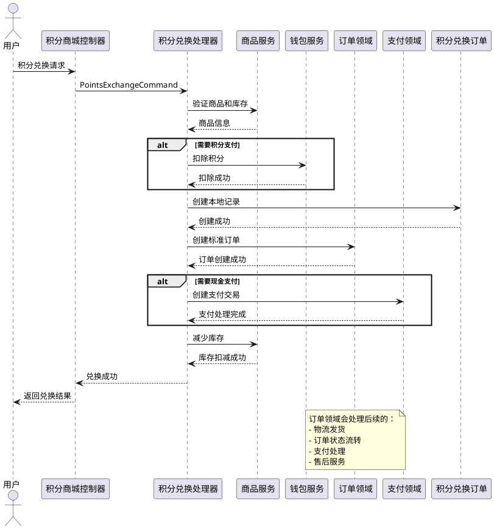
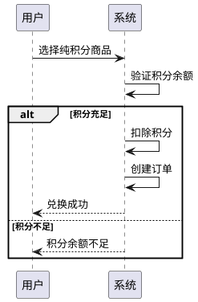
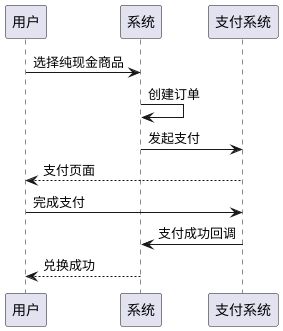
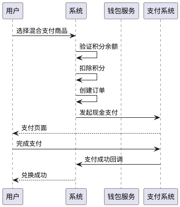

# 积分商城系统技术方案

## 1. 领域概述

### 1.1 领域定位

积分商城是一个独立的领域，主要负责积分商品管理、积分兑换订单处理和积分余额管理。它与商品领域、订单领域、钱包领域进行集成，提供完整的积分兑换服务。

### 1.2 核心职责

- **积分商品管理**：管理积分商品的发布、上下架、库存等
- **积分兑换处理**：处理用户的积分兑换请求，支持多种支付模式
- **订单集成**：与订单领域集成，统一处理订单流程
- **积分管理**：与钱包领域集成，管理用户积分余额
- **支付处理**：支持纯积分、纯现金、积分+现金混合支付模式

### 1.3 业务价值

- 提升用户活跃度，通过积分兑换增加用户粘性
- 提供多样化的支付方式，满足不同用户需求
- 与现有系统无缝集成，复用订单和支付流程
- 支持灵活的积分商品配置，满足业务需求

## 2. 领域模型设计

### 2.1 核心实体

#### 积分商品 (PointsProduct)

积分商品是积分商城领域的聚合根，负责管理积分商品的基本信息和兑换规则。

```plantuml
class 积分商品 {
  +id: string
  +title: string
  +description: string
  +image: string
  +point: decimal
  +price: Money
  +payment_mode: PointsProductPaymentModeEnum
  +stock_quantity: int
  +exchange_limit: int
  +status: PointsProductStatusEnum
  +sort: int
  +category_id: int
  +product_type: string
  +product_id: string
  --
  +getActualMoneyPrice(): Money
  +getTotalValue(): Money
  +isMixedPaymentMode(): bool
  +isPointsOnlyPaymentMode(): bool
  +isMoneyOnlyPaymentMode(): bool
}
```

#### 积分兑换订单 (PointsExchangeOrder)

积分兑换订单是积分商城领域的聚合根，负责管理积分兑换的完整流程。

```plantuml
class 积分兑换订单 {
  +id: string
  +point_order_no: string
  +order_no: string
  +product_id: string
  +product_title: string
  +points_price: int
  +money_price: Money
  +quantity: int
  +total_points: int
  +total_money: Money
  +payment_mode: PointsProductPaymentModeEnum
  +status: PointsExchangeOrderStatusEnum
  +exchange_time: DateTime
  +shipping_info: array
  +address_info: array
  +payment_info: array
  --
  +getTotalValue(): Money
  +isMixedPayment(): bool
  +isPointsOnlyPayment(): bool
  +isMoneyOnlyPayment(): bool
}
```

### 2.2 值对象

#### 支付信息 (PaymentInfo)

```plantuml
class 支付信息 {
  +payment_mode: PointsProductPaymentModeEnum
  +points_amount: int
  +money_amount: Money
  +payment_method: string
  +trade_no: string
}
```

#### 兑换限制 (ExchangeLimit)

```plantuml
class 兑换限制 {
  +max_per_user: int
  +max_per_order: int
  +time_limit: int
  +user_level_required: int
}
```

### 2.3 枚举定义

#### 积分商品状态 (PointsProductStatusEnum)

- `DRAFT` - 草稿
- `ON_SALE` - 上架销售
- `OFF_SALE` - 下架
- `SOLD_OUT` - 售罄

#### 积分商品支付模式 (PointsProductPaymentModeEnum)

- `POINTS_ONLY` - 纯积分支付
- `MONEY_ONLY` - 纯现金支付
- `MIXED` - 积分+现金混合支付

#### 积分兑换订单状态 (PointsExchangeOrderStatusEnum)

- `EXCHANGED` - 已兑换
- `ORDER_CREATED` - 订单已创建
- `ORDER_PAID` - 订单已支付
- `ORDER_ACCEPTED` - 订单已接单
- `ORDER_SHIPPED` - 订单已发货
- `ORDER_FINISHED` - 订单已完成
- `ORDER_CANCELED` - 订单已取消

## 3. 应用层设计

### 3.1 应用服务

#### 积分商城应用服务 (PointsMallApplicationService)

```plantuml
class 积分商城应用服务 {
  +exchange(PointsExchangeCommand): PointsExchangeOrder
  +checkExchange(PointsCheckExchangeCommand): ValidationResult
  +listProducts(PointsListProductsQuery): LengthAwarePaginator
  +getProduct(PointsGetProductQuery): PointsProduct
  +createProduct(PointsProductCreateCommand): PointsProduct
  +updateProduct(PointsProductUpdateCommand): PointsProduct
  +deleteProduct(PointsProductDeleteCommand): bool
}
```

### 3.2 命令和查询

#### 命令 (Commands)

- `PointsExchangeCommand` - 积分兑换命令
- `PointsCheckExchangeCommand` - 检查兑换资格命令
- `PointsProductCreateCommand` - 创建积分商品命令
- `PointsProductUpdateCommand` - 更新积分商品命令
- `PointsProductDeleteCommand` - 删除积分商品命令

#### 查询 (Queries)

- `PointsListProductsQuery` - 积分商品列表查询
- `PointsGetProductQuery` - 获取积分商品查询
- `PointsExchangeOrderQuery` - 积分兑换订单查询

### 3.3 命令处理器

#### 积分兑换命令处理器 (PointsExchangeCommandHandler)

```plantuml
sequenceDiagram
    participant User as 用户
    participant Handler as 积分兑换处理器
    participant ProductService as 商品服务
    participant WalletService as 钱包服务
    participant OrderService as 订单服务
    participant PaymentService as 支付服务

    User->>Handler: 积分兑换请求
    Handler->>ProductService: 验证商品和库存
    ProductService-->>Handler: 商品信息
    Handler->>WalletService: 扣除积分
    WalletService-->>Handler: 扣除成功
    Handler->>Handler: 创建本地兑换记录
    Handler->>OrderService: 创建标准订单
    OrderService-->>Handler: 订单创建成功
    Handler->>PaymentService: 处理现金支付
    PaymentService-->>Handler: 支付处理完成
    Handler-->>User: 返回兑换结果
```

## 4. 基础设施层设计

### 4.1 仓库接口

#### 积分商品仓库 (PointsProductRepositoryInterface)

```php
interface PointsProductRepositoryInterface extends RepositoryInterface
{
    public function findOnSale(): Collection;
    public function decreaseStock(string $productId, int $quantity): bool;
    public function findByCategory(int $categoryId): Collection;
    public function findByPaymentMode(PointsProductPaymentModeEnum $mode): Collection;
}
```

#### 积分商品只读仓库 (PointsProductReadRepositoryInterface)

```php
interface PointsProductReadRepositoryInterface extends ReadRepositoryInterface
{
    public function findWithCategory(string $productId): ?PointsProduct;
    public function findOnSaleByCategory(int $categoryId): Collection;
    public function searchByKeyword(string $keyword): Collection;
}
```

#### 积分兑换订单仓库 (PointsExchangeOrderRepositoryInterface)

```php
interface PointsExchangeOrderRepositoryInterface extends RepositoryInterface
{
    public function findByOrderNo(string $orderNo): ?PointsExchangeOrder;
    public function findByBuyer(UserInterface $buyer): Collection;
    public function countByBuyerAndProduct(UserInterface $buyer, string $productId): int;
}
```

### 4.2 外部服务集成

#### 商品服务集成 (ProductServiceIntegration)

- 商品信息查询
- 库存管理
- 商品状态校验

#### 钱包服务集成 (WalletServiceIntegration)

- 积分余额查询
- 积分扣除
- 积分交易记录

#### 订单服务集成 (OrderServiceIntegration)

- 订单创建
- 订单状态管理
- 订单流程控制

#### 支付服务集成 (PaymentServiceIntegration)

- 支付交易创建
- 支付状态管理
- 支付方式支持

## 5. 用户接口层设计

### 5.1 控制器

#### 积分商城控制器 (PointsMallController)

```php
class PointsMallController extends Controller
{
    protected static string $resourceClass = PointsProductResource::class;
    protected static string $paginateQueryClass = PointsProductListQuery::class;
    protected static string $modelClass = PointsProduct::class;
    protected static string $dataClass = PointsProductData::class;

    use RestControllerActions;

    public function __construct(
        protected PointsMallApplicationService $service,
    ) {
        $this->service->readRepository->withQuery(function ($query) {
            $query->where('status', PointsProductStatusEnum::ON_SALE);
        });
    }

    /**
     * 积分兑换
     */
    public function exchange(PointsExchangeRequest $request): JsonResponse
    {
        $request->validated();
        $request->offsetSet('buyer', $this->getOwner());

        $command = PointsExchangeCommand::from($request);
        $order = $this->service->exchange($command);

        return response()->json([
            'success' => true,
            'data' => new PointsExchangeOrderResource($order)
        ]);
    }

    /**
     * 检查兑换资格
     */
    public function checkExchange(PointsCheckExchangeRequest $request): JsonResponse
    {
        $request->validated();
        $request->offsetSet('buyer', $this->getOwner());

        $command = PointsCheckExchangeCommand::from($request);
        $result = $this->service->checkExchange($command);

        return response()->json($result);
    }
}
```

#### 积分兑换订单控制器 (PointsExchangeOrderController)

```php
class PointsExchangeOrderController extends Controller
{
    protected static string $resourceClass = PointsExchangeOrderResource::class;
    protected static string $paginateQueryClass = PointsExchangeOrderQuery::class;
    protected static string $modelClass = PointsExchangeOrder::class;
    protected static string $dataClass = PointsExchangeOrderData::class;

    use RestControllerActions;

    public function __construct(
        protected PointsMallApplicationService $service,
    ) {
        $this->service->readRepository->withQuery(function ($query) {
            $query->onlyOwner($this->getOwner());
        });
    }
}
```

### 5.2 API资源

#### 积分商品资源 (PointsProductResource)

```php
class PointsProductResource extends JsonResource
{
    public function toArray($request)
    {
        return [
            'id' => $this->id,
            'title' => $this->title,
            'description' => $this->description,
            'image' => $this->image,
            'points_price' => $this->points_price,
            'money_price' => $this->money_price,
            'payment_mode' => $this->payment_mode,
            'original_price' => $this->original_price,
            'stock_quantity' => $this->stock_quantity,
            'exchange_limit' => $this->exchange_limit,
            'status' => $this->status,
            'sort' => $this->sort,
            'product_type' => $this->product_type,
            'shipping_type' => $this->shipping_type,
            'created_at' => $this->created_at,
            'updated_at' => $this->updated_at,
            
            // 支付信息
            'payment_info' => [
                'mode' => $this->payment_mode->label(),
                'points' => $this->points_price > 0 ? $this->points_price . ' 积分' : null,
                'money' => $this->money_price->getAmount() > 0 ? '¥' . $this->money_price->getAmount() : null,
                'total_value' => $this->getTotalValue()->getAmount(),
            ],
            
            // 关联信息
            'category' => $this->whenLoaded('category', function () {
                return new CategoryResource($this->category);
            }),
        ];
    }
}
```

#### 积分兑换订单资源 (PointsExchangeOrderResource)

```php
class PointsExchangeOrderResource extends JsonResource
{
    public function toArray($request)
    {
        return [
            'id' => $this->id,
            'order_no' => $this->order_no,
            'order_id' => $this->order_id,
            'product_id' => $this->product_id,
            'product_title' => $this->product_title,
            'points_price' => $this->points_price,
            'money_price' => $this->money_price,
            'quantity' => $this->quantity,
            'total_points' => $this->total_points,
            'total_money' => $this->total_money,
            'payment_mode' => $this->payment_mode,
            'status' => $this->status,
            'exchange_time' => $this->exchange_time,
            'shipping_info' => $this->shipping_info,
            'address_info' => $this->address_info,
            'payment_info' => $this->payment_info,
            'created_at' => $this->created_at,
            'updated_at' => $this->updated_at,
            
            // 关联的订单信息
            'order' => $this->whenLoaded('order', function () {
                return new OrderResource($this->order);
            }),
            
            // 关联的商品信息
            'product' => $this->whenLoaded('product', function () {
                return new PointsProductResource($this->product);
            }),
        ];
    }
}
```

### 5.3 请求验证

#### 积分兑换请求验证 (PointsExchangeRequest)

```php
class PointsExchangeRequest extends FormRequest
{
    public function authorize(): bool
    {
        return true;
    }

    public function rules(): array
    {
        return [
            'product_id' => ['required', 'string'],
            'quantity' => ['required', 'integer', 'min:1'],
            'cash_amount' => ['nullable', 'numeric', 'min:0'],
            'payment_method' => ['nullable', 'string', 'in:wallet,alipay,wechat,bank_card'],
            'buyer_remarks' => ['nullable', 'string', 'max:500'],
            'buyer_message' => ['nullable', 'string', 'max:500'],
            'customized' => ['nullable', 'array'],
            'address' => ['nullable', 'array'],
        ];
    }

    public function messages(): array
    {
        return [
            'product_id.required' => '商品ID不能为空',
            'quantity.required' => '数量不能为空',
            'quantity.min' => '数量必须大于0',
            'cash_amount.min' => '现金金额不能为负数',
            'payment_method.in' => '不支持的支付方式',
        ];
    }
}
```

## 6. 路由设计

### 6.1 积分商城路由 (PointsMallRoute)

```php
class PointsMallRoute
{
    public static function api(): void
    {
        Route::group(['prefix' => 'points-mall'], function () {
            // 商品相关
            Route::get('products', [PointsMallController::class, 'index']);
            Route::get('products/{id}', [PointsMallController::class, 'show']);
            Route::get('products/category/{categoryId}', [PointsMallController::class, 'productsByCategory']);
            Route::get('products/search', [PointsMallController::class, 'search']);
            
            // 兑换相关
            Route::post('exchange', [PointsMallController::class, 'exchange']);
            Route::post('check-exchange', [PointsMallController::class, 'checkExchange']);
            
            // 订单相关
            Route::get('orders', [PointsExchangeOrderController::class, 'index']);
            Route::get('orders/{id}', [PointsExchangeOrderController::class, 'show']);
            Route::get('orders/statistics', [PointsExchangeOrderController::class, 'statistics']);
        });
    }

    public static function web(): void
    {
        Route::group(['prefix' => 'points-mall'], function () {
            Route::get('products', [PointsMallController::class, 'index']);
            Route::get('products/{id}', [PointsMallController::class, 'show']);
            Route::get('orders', [PointsExchangeOrderController::class, 'index']);
        });
    }
}
```

## 7. 与现有领域集成

### 7.1 商品领域集成

- **商品信息复用**：积分商品可以关联到商品领域的商品
- **库存管理**：复用商品领域的库存管理机制
- **分类体系**：复用商品领域的分类体系

### 7.2 订单领域集成

- **订单创建**：积分兑换订单推送到订单领域统一处理
- **状态同步**：通过事件监听器实现状态同步
- **流程复用**：复用订单领域的物流、支付、售后流程

### 7.3 钱包领域集成

- **积分管理**：直接使用钱包领域的积分钱包
- **交易记录**：复用钱包领域的交易记录机制
- **余额管理**：复用钱包领域的余额管理功能

### 7.4 支付领域集成

- **支付处理**：复用支付领域的支付处理机制
- **支付方式**：支持多种支付方式
- **支付状态**：复用支付领域的状态管理

## 8. 核心业务流程

### 8.1 积分兑换完整流程



### 8.2 支付模式处理流程

#### 纯积分支付模式



#### 纯现金支付模式



#### 混合支付模式



## 9. 配置设计

### 9.1 积分商城配置 (points-mall.php)

```php
return [
    'exchange' => [
        'min_points' => 1,                    // 最小兑换积分
        'max_points_per_order' => 10000,      // 单次最大兑换积分
        'exchange_limit_enabled' => true,      // 是否启用兑换限制
        'auto_confirm_timeout' => 24 * 60,    // 自动确认超时时间（分钟）
    ],
    
    'wallet' => [
        'type' => 'integral',                 // 积分钱包类型
        'currency' => 'ZJF',                  // 积分货币代码
    ],
    
    'order' => [
        'auto_create_logistics' => true,      // 是否自动创建物流订单
        'order_type' => 'points_exchange',    // 订单类型
        'currency' => 'CNY',                  // 现金部分使用人民币
        'payment_method' => 'mixed',          // 混合支付
    ],
    
    // 支付配置
    'payment' => [
        'merchant_app_id' => env('POINTS_MALL_MERCHANT_APP_ID'),
        'supported_methods' => [
            'wallet' => '钱包支付',
            'alipay' => '支付宝',
            'wechat' => '微信支付',
            'bank_card' => '银行卡',
        ],
        'default_method' => 'wallet',
    ],
    
    // 积分兑换比例配置
    'points_rate' => [
        'points_to_cny' => 0.01,              // 1积分 = 0.01元
        'cny_to_points' => 100,               // 1元 = 100积分
    ],
    
    // 订单状态同步配置
    'order_sync' => [
        'enabled' => true,
        'events' => [
            'created',
            'paid', 
            'accepted',
            'shipped',
            'finished',
            'canceled',
        ],
    ],
];
```

## 10. 数据库设计

### 10.1 积分商品表 (points_products)

```sql
CREATE TABLE `points_products` (
  `id` bigint unsigned NOT NULL AUTO_INCREMENT,
  `title` varchar(255) NOT NULL COMMENT '商品标题',
  `description` text COMMENT '商品描述',
  `image` varchar(500) DEFAULT NULL COMMENT '商品图片',
  `point` int NOT NULL DEFAULT '0' COMMENT '积分价格',
  `price_currency` varchar(3) NOT NULL  COMMENT '价格货币',
  `price_amount` decimal(10,2) NOT NULL DEFAULT '0.00' COMMENT '价格金额',
  `payment_mode` varchar(32) NOT NULL DEFAULT 'points_only' COMMENT '支付模式',
  `stock_quantity` int NOT NULL DEFAULT '0' COMMENT '库存数量',
  `exchange_limit` int NOT NULL DEFAULT '0' COMMENT '兑换限制',
  `status` varchar(32) NOT NULL DEFAULT 'on_sale' COMMENT '状态',
  `sort` int NOT NULL DEFAULT '0' COMMENT '排序',
  `category_id` bigint unsigned DEFAULT NULL COMMENT '分类ID',
  `product_type` varchar(32) NOT NULL DEFAULT 'physical' COMMENT '商品类型',
  `shipping_type` varchar(32) NOT NULL DEFAULT 'logistics' COMMENT '发货类型',
  `outer_id` varchar(64) DEFAULT NULL COMMENT '外部ID',
  `properties` json DEFAULT NULL COMMENT '属性',
  `owner_type` varchar(32) NOT NULL COMMENT '所属者类型',
  `owner_id` varchar(64) NOT NULL COMMENT '所属者ID',
  `operator_type` varchar(32) DEFAULT NULL COMMENT '操作者类型',
  `operator_id` varchar(64) DEFAULT NULL COMMENT '操作者ID',
  `created_at` timestamp NULL DEFAULT NULL,
  `updated_at` timestamp NULL DEFAULT NULL,
  `deleted_at` timestamp NULL DEFAULT NULL,
  PRIMARY KEY (`id`),
  KEY `idx_status_sort` (`status`,`sort`),
  KEY `idx_category_id` (`category_id`),
  KEY `idx_payment_mode` (`payment_mode`),
  KEY `idx_owner` (`owner_type`,`owner_id`)
) ENGINE=InnoDB DEFAULT CHARSET=utf8mb4 COLLATE=utf8mb4_unicode_ci COMMENT='积分商品表';
```

### 10.2 积分兑换订单表 (points_exchange_orders)

```sql
CREATE TABLE `points_exchange_orders` (
  `id` bigint unsigned NOT NULL AUTO_INCREMENT,
  `order_no` varchar(64) NOT NULL COMMENT '兑换订单号',
  `order_id` bigint unsigned DEFAULT NULL COMMENT '关联订单ID',
  `product_id` bigint unsigned NOT NULL COMMENT '商品ID',
  `product_title` varchar(255) NOT NULL COMMENT '商品标题',
  `points_price` int NOT NULL DEFAULT '0' COMMENT '积分价格',
  `money_price` decimal(10,2) NOT NULL DEFAULT '0.00' COMMENT '现金价格',
  `quantity` int NOT NULL DEFAULT '1' COMMENT '数量',
  `total_points` int NOT NULL DEFAULT '0' COMMENT '总积分',
  `total_money` decimal(10,2) NOT NULL DEFAULT '0.00' COMMENT '总现金',
  `payment_mode` varchar(32) NOT NULL COMMENT '支付模式',
  `status` varchar(32) NOT NULL DEFAULT 'exchanged' COMMENT '状态',
  `exchange_time` timestamp NOT NULL COMMENT '兑换时间',
  `shipping_info` json DEFAULT NULL COMMENT '物流信息',
  `address_info` json DEFAULT NULL COMMENT '地址信息',
  `payment_info` json DEFAULT NULL COMMENT '支付信息',
  `owner_type` varchar(32) NOT NULL COMMENT '所属者类型',
  `owner_id` varchar(64) NOT NULL COMMENT '所属者ID',
  `operator_type` varchar(32) DEFAULT NULL COMMENT '操作者类型',
  `operator_id` varchar(64) DEFAULT NULL COMMENT '操作者ID',
  `created_at` timestamp NULL DEFAULT NULL,
  `updated_at` timestamp NULL DEFAULT NULL,
  `deleted_at` timestamp NULL DEFAULT NULL,
  PRIMARY KEY (`id`),
  UNIQUE KEY `uk_order_no` (`order_no`),
  KEY `idx_order_id` (`order_id`),
  KEY `idx_product_id` (`product_id`),
  KEY `idx_status` (`status`),
  KEY `idx_owner` (`owner_type`,`owner_id`)
) ENGINE=InnoDB DEFAULT CHARSET=utf8mb4 COLLATE=utf8mb4_unicode_ci COMMENT='积分兑换订单表';
```

## 11. 监控和运维

### 11.1 关键指标

- 积分兑换成功率
- 积分兑换响应时间
- 积分余额使用率
- 积分商品转化率
- 混合支付使用率

### 11.2 日志记录

- 积分兑换操作日志
- 积分余额变动日志
- 订单状态同步日志
- 支付处理日志
- 异常处理日志

### 11.3 告警机制

- 积分余额不足告警
- 库存不足告警
- 支付失败告警
- 订单同步失败告警

## 12. 统一语言表

| 英文名称 | 中文名称 | 说明 | 示例 |
|---------|---------|------|------|
| PointsProduct | 积分商品 | 可以用积分兑换的商品 | 积分商城中的商品 |
| PointsExchangeOrder | 积分兑换订单 | 用户积分兑换的记录 | 用户的兑换订单 |
| PointsProductPaymentMode | 积分商品支付模式 | 商品的支付方式配置 | 纯积分、纯现金、混合支付 |
| PointsExchangeOrderStatus | 积分兑换订单状态 | 兑换订单的状态流转 | 已兑换、已支付、已完成 |
| ExchangeLimit | 兑换限制 | 商品兑换的限制条件 | 每人限购数量 |
| PaymentInfo | 支付信息 | 支付相关的详细信息 | 支付方式、金额、交易号 |

## 13. 扩展性设计

### 13.1 支付模式扩展

- 支持更多支付方式
- 支持积分抵扣比例配置
- 支持阶梯定价

### 13.2 商品类型扩展

- 支持虚拟商品
- 支持服务类商品
- 支持定制化商品

### 13.3 营销功能扩展

- 积分商品促销
- 积分商品推荐
- 积分商品分类

### 13.4 用户功能扩展

- 积分商品收藏
- 积分商品评价
- 积分商品分享

## 14. 安全设计

### 14.1 数据安全

- 积分余额加密存储
- 支付信息脱敏处理
- 用户隐私保护

### 14.2 业务安全

- 积分兑换频率限制
- 异常兑换行为检测
- 防刷机制

### 14.3 系统安全

- API接口权限控制
- 数据访问权限控制
- 操作日志审计

## 15. 性能优化

### 15.1 数据库优化

- 合理设计索引
- 分库分表策略
- 读写分离

### 15.2 缓存优化

- 商品信息缓存
- 用户积分缓存
- 订单状态缓存

### 15.3 接口优化

- 接口响应时间优化
- 并发处理能力优化
- 资源使用优化

这个技术方案提供了完整的积分商城系统设计，包括领域模型、应用层、基础设施层、用户接口层的完整实现，以及与现有系统的集成方案。 