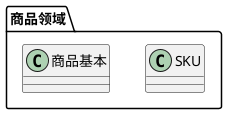

# 商品类目

## 介绍

商品类目是电商领域的基础设施，商品类目是将商品进行统一和标准化管理，主要是商家和平台运营的使用。
需要却别与前台运营类目、卖家分类。

## 模型

```plantuml
@startuml

package  商品领域{

    class SKU{

    }
    class 商品基本{

    }
}
@enduml

```

## 用例

## 查询

## 存储层
### 仓库接口
### 只读仓库接口
