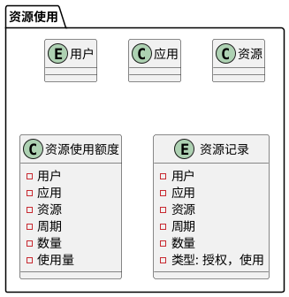

# 资源使用量

## 概述

这个一个基于用户资源使用量的专有领域，可以使用会员权益中构建完整的会员功能。

## 目标

- 支持用户对于资源使用量的授权、记录、统计、管理

## 领域分析

### 核心模型

```plantuml
@startuml

package 资源使用 {

entity 用户{}

class 应用{}

class 资源{}

class 资源使用额度{
   - 用户
   - 应用
   - 资源
   - 周期
   - 数量
   - 使用量
}


entity 资源记录{
   - 用户
   - 应用
   - 资源
   - 周期
   - 数量
   - 类型: 授权，使用
}

}

@enduml
```

