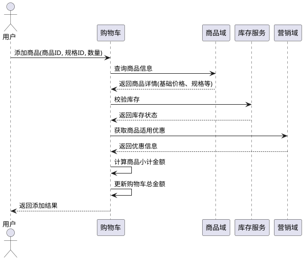
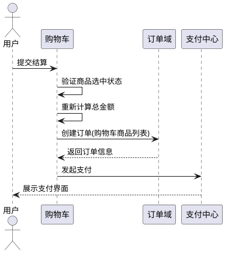

# 电商购物车领域技术方案

## 1. 领域定位与职责

购物车作为商城核心应用层的关键组件，主要负责以下职责：
- 商品临时存储与管理
- 实时价格计算（含商品基础价格与优惠金额）
- 库存可用性校验
- 订单转化前的数据准备
- 对接商品域、营销域、订单域的核心能力

## 2. 核心依赖组件

```plantuml
@startuml
component 购物车核心  {
  component 商品域 [商品信息/价格]
  component 营销域 [优惠计算]
  component 库存服务 [库存校验]
  component 用户服务 [用户信息]
  component 基础服务 {
    component 货币服务
    component 语言服务
  }
}
@enduml
```

## 3. 核心数据模型

### 3.1 购物车实体
| 属性名 | 类型 | 说明 |
|--------|------|------|
| id | string | 购物车唯一标识 |
| userId | string | 用户ID |
| items | array | 购物车商品项列表 |
| totalAmount | decimal | 商品总金额 |
| discountAmount | decimal | 优惠总金额 |
| finalAmount | decimal | 最终支付金额 |
| createdAt | datetime | 创建时间 |
| updatedAt | datetime | 更新时间 |

### 3.2 购物车商品项
| 属性名 | 类型 | 说明 |
|--------|------|------|
| id | string | 商品项ID |
| cartId | string | 购物车ID |
| productId | string | 商品ID |
| skuId | string | 商品规格ID |
| quantity | int | 商品数量 |
| unitPrice | decimal | 单价 |
| discount | decimal | 单品优惠金额 |
| subtotal | decimal | 商品小计金额 |
| selected | boolean | 是否选中 |

## 4. 核心业务流程

### 4.1 添加商品到购物车



### 4.2 购物车结算流程



## 5. 核心能力实现

### 5.1 金额计算规则
1. **单价确定**：调用商品域接口获取实时价格，受以下因素影响：
   - 商品基础价格
   - 用户等级
   - 购买渠道
   - 区域限制
   - 时间限制

2. **优惠计算**：对接营销域实现多层级优惠叠加：
   - 商品级优惠(单品折扣、限时特价)
   - 购物车级优惠(满减、满赠)
   - 用户级优惠(优惠券、积分抵扣)

3. **金额公式**：
   ```
   商品小计 = 单价 × 数量 - 单品优惠
   购物车总金额 = Σ商品小计
   最终支付金额 = 购物车总金额 - 购物车级优惠 - 用户级优惠 + 运费 + 税费
   ```

### 5.2 库存校验机制
- 添加商品时进行预占库存
- 结算时进行最终库存锁定
- 未结算超时自动释放库存
- 支持多仓库库存合并计算

## 6. 与其他领域集成点

### 6.1 商品域
- 提供商品基础信息查询
- 提供实时价格查询
- 提供商品状态校验

### 6.2 营销域
- 提供优惠规则匹配
- 提供优惠券适用校验
- 提供促销活动查询

### 6.3 订单域
- 提供订单创建接口
- 支持购物车数据转换为订单数据
- 提供订单状态回调

### 6.4 支付域
- 提供支付方式查询
- 支持合并支付创建
- 提供支付结果通知

## 7. 性能优化策略

1. **缓存设计**：
   - 用户购物车数据缓存至Redis
   - 热门商品价格缓存
   - 优惠规则缓存

2. **数据库优化**：
   - 购物车表按用户ID分表
   - 历史购物车数据归档
   - 索引优化(用户ID、商品ID)

3. **异步处理**：
   - 非关键计算异步化
   - 库存预占异步确认
   - 统计数据异步更新

## 8. 异常处理机制

| 异常场景 | 处理策略 |
|---------|---------|
| 商品价格变动 | 提示用户价格更新，重新计算 |
| 商品库存不足 | 提示库存不足，建议调整数量 |
| 优惠活动过期 | 自动移除过期优惠，重新计算 |
| 系统服务降级 | 使用本地缓存数据，保障基本功能 |
| 网络请求超时 | 实现重试机制，限制重试次数 |

## 9. 扩展能力设计

### 9.1 多端适配
- 支持PC端、移动端、小程序等多端数据同步
- 游客购物车与用户购物车合并

### 9.2 个性化功能
- 支持商品收藏与购物车联动
- 最近浏览商品自动推荐
- 购物车商品标签管理

### 9.3 国际化支持
- 多货币金额计算
- 多语言提示信息
- 区域化价格策略