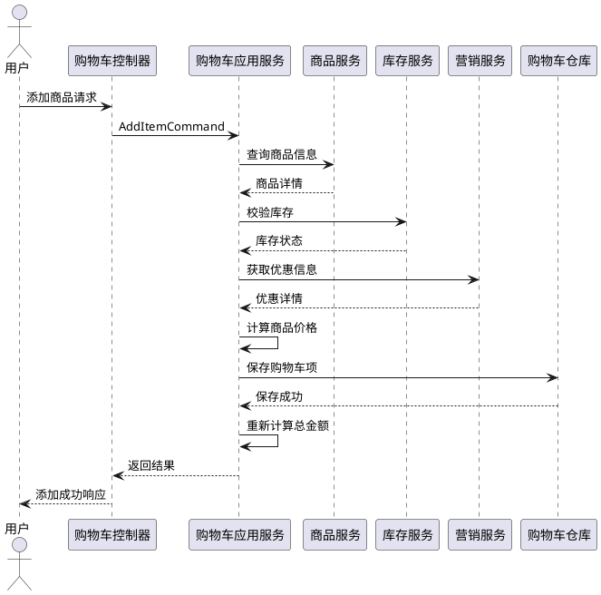
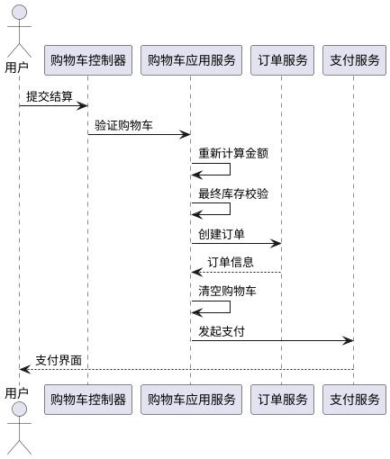

# 购物车领域技术方案

## 1. 领域概述

### 1.1 领域定位
购物车领域是电商系统的核心应用层组件，负责管理用户的商品选择、价格计算、库存校验和订单转化前的数据准备。它是连接商品域、营销域、订单域的关键桥梁。

### 1.2 核心职责
- **商品管理**：临时存储用户选择的商品和规格
- **价格计算**：实时计算商品价格和优惠金额
- **库存校验**：确保商品库存可用性
- **数据转换**：为订单创建提供标准化的数据格式
- **多端同步**：支持PC、移动端、小程序等数据同步

### 1.3 业务价值
- 提升用户购物体验，简化商品选择流程
- 提供实时价格计算，增强用户购买信心
- 支持复杂优惠策略，提高转化率
- 为订单系统提供标准化数据，降低系统耦合

## 2. 领域模型设计

### 2.1 核心实体

#### 购物车 (Cart)
购物车是购物车领域的聚合根，负责管理用户的商品选择状态和金额计算。

```plantuml
class 购物车 {
  +id: string
  +userId: string
  +market: string
  +owner: UserInterface
  +operator: UserInterface
  +status: CartStatusEnum
  +totalAmount: Money
  +discountAmount: Money
  +finalAmount: Money
  +createdAt: DateTime
  +updatedAt: DateTime
  +expiredAt: DateTime
  --
  +addItem(CartItem): void
  +removeItem(itemId: string): void
  +updateQuantity(itemId: string, quantity: int): void
  +selectItem(itemId: string, selected: bool): void
  +calculateAmount(): void
  +validateStock(): bool
  +clear(): void
  +isExpired(): bool
}
```

#### 购物车商品项 (CartItem)
购物车商品项是购物车聚合内的实体，表示用户选择的单个商品。

```plantuml
class 购物车商品项 {
  +id: string
  +cartId: string
  +productId: string
  +skuId: string
  +quantity: int
  +unitPrice: Money
  +originalPrice: Money
  +discountAmount: Money
  +subtotal: Money
  +selected: bool
  +properties: array
  +createdAt: DateTime
  +updatedAt: DateTime
  --
  +calculateSubtotal(): void
  +updateQuantity(quantity: int): void
  +isAvailable(): bool
}
```

### 2.2 值对象

#### 商品属性 (ProductProperties)
```plantuml
class 商品属性 {
  +pid: int
  +name: string
  +value: string
  +alias: string
}
```

#### 价格信息 (PriceInfo)
```plantuml
class 价格信息 {
  +unitPrice: Money
  +originalPrice: Money
  +discountAmount: Money
  +promotionType: string
  +promotionId: string
}
```

### 2.3 枚举定义

#### 购物车状态 (CartStatusEnum)
- `ACTIVE` - 活跃状态
- `EXPIRED` - 已过期
- `CONVERTED` - 已转化为订单
- `CLEARED` - 已清空

## 3. 应用层设计

### 3.1 应用服务

#### 购物车应用服务 (CartApplicationService)
```plantuml
class 购物车应用服务 {
  +addItem(AddItemCommand): CartItem
  +removeItem(RemoveItemCommand): bool
  +updateQuantity(UpdateQuantityCommand): CartItem
  +selectItems(SelectItemsCommand): void
  +calculateAmount(CalculateAmountCommand): Cart
  +clearCart(ClearCartCommand): bool
  +mergeGuestCart(MergeGuestCartCommand): Cart
  +validateCart(ValidateCartCommand): ValidationResult
}
```

### 3.2 命令和查询

#### 命令 (Commands)
- `AddItemCommand` - 添加商品到购物车
- `RemoveItemCommand` - 从购物车移除商品
- `UpdateQuantityCommand` - 更新商品数量
- `SelectItemsCommand` - 选择/取消选择商品
- `CalculateAmountCommand` - 计算购物车金额
- `ClearCartCommand` - 清空购物车
- `MergeGuestCartCommand` - 合并游客购物车

#### 查询 (Queries)
- `FindCartQuery` - 查找购物车
- `ListCartItemsQuery` - 查询购物车商品列表
- `CalculateAmountQuery` - 计算金额查询

### 3.3 命令处理器

#### 添加商品处理器 (AddItemCommandHandler)
```plantuml
sequenceDiagram
    participant User as 用户
    participant Handler as 添加商品处理器
    participant ProductService as 商品服务
    participant StockService as 库存服务
    participant PromotionService as 营销服务
    participant CartRepository as 购物车仓库

    User->>Handler: 添加商品请求
    Handler->>ProductService: 查询商品信息
    ProductService-->>Handler: 返回商品详情
    Handler->>StockService: 校验库存
    StockService-->>Handler: 返回库存状态
    Handler->>PromotionService: 获取优惠信息
    PromotionService-->>Handler: 返回优惠详情
    Handler->>Handler: 计算商品价格
    Handler->>CartRepository: 保存购物车项
    CartRepository-->>Handler: 保存成功
    Handler-->>User: 返回添加结果
```

## 4. 基础设施层设计

### 4.1 仓库接口

#### 购物车仓库 (CartRepositoryInterface)
```php
interface CartRepositoryInterface extends RepositoryInterface
{
    public function findByUser(UserInterface $user): ?Cart;
    public function findActiveByUser(UserInterface $user): ?Cart;
    public function findExpiredCarts(): Collection;
    public function clearExpiredCarts(): int;
}
```

#### 购物车只读仓库 (CartReadRepositoryInterface)
```php
interface CartReadRepositoryInterface extends ReadRepositoryInterface
{
    public function findWithItems(string $cartId): ?Cart;
    public function findItemsByCart(string $cartId): Collection;
    public function countUserCarts(UserInterface $user): int;
}
```

### 4.2 外部服务集成

#### 商品服务集成 (ProductServiceIntegration)
- 商品信息查询
- 实时价格获取
- 商品状态校验
- 规格信息获取

#### 营销服务集成 (PromotionServiceIntegration)
- 优惠规则匹配
- 优惠券适用校验
- 促销活动查询
- 优惠金额计算

#### 库存服务集成 (StockServiceIntegration)
- 库存可用性校验
- 库存预占
- 库存释放
- 多仓库库存查询

## 5. 核心业务流程

### 5.1 添加商品到购物车流程



### 5.2 购物车结算流程



## 6. 价格计算策略

### 6.1 计算规则
1. **基础价格获取**：从商品服务获取实时价格
2. **优惠叠加计算**：支持多层级优惠叠加
3. **最终金额计算**：基础金额 - 优惠金额 + 运费 + 税费

### 6.2 优惠计算层级
- **商品级优惠**：单品折扣、限时特价
- **购物车级优惠**：满减、满赠、优惠券
- **用户级优惠**：会员折扣、积分抵扣

### 6.3 价格计算公式
```
商品小计 = 单价 × 数量 - 单品优惠
购物车总金额 = Σ商品小计
最终支付金额 = 购物车总金额 - 购物车级优惠 - 用户级优惠 + 运费 + 税费
```

## 7. 性能优化策略

### 7.1 缓存设计
- **Redis缓存**：用户购物车数据缓存
- **商品价格缓存**：热门商品价格缓存
- **优惠规则缓存**：营销规则缓存

### 7.2 数据库优化
- **分表策略**：按用户ID分表
- **索引优化**：用户ID、商品ID、创建时间索引
- **数据归档**：历史购物车数据归档

### 7.3 异步处理
- **价格计算**：非关键计算异步化
- **库存预占**：异步确认机制
- **统计数据**：异步更新统计

## 8. 异常处理机制

### 8.1 异常类型
- `CartItemNotFoundException` - 购物车商品项不存在
- `InsufficientStockException` - 库存不足
- `PriceChangedException` - 价格变动
- `PromotionExpiredException` - 优惠过期
- `CartExpiredException` - 购物车过期

### 8.2 处理策略
- **价格变动**：提示用户价格更新，重新计算
- **库存不足**：提示库存不足，建议调整数量
- **优惠过期**：自动移除过期优惠，重新计算
- **系统降级**：使用本地缓存数据，保障基本功能

## 9. 扩展能力设计

### 9.1 多端适配
- **数据同步**：支持PC、移动端、小程序数据同步
- **游客合并**：游客购物车与用户购物车合并
- **设备识别**：基于设备ID的购物车隔离

### 9.2 个性化功能
- **商品推荐**：基于购物车内容的商品推荐
- **智能提醒**：库存不足、价格变动提醒
- **购物车标签**：商品分类和标签管理

### 9.3 国际化支持
- **多货币**：支持多货币金额计算
- **多语言**：多语言提示信息
- **区域化**：区域化价格和优惠策略

## 10. 监控和运维

### 10.1 关键指标
- 购物车添加成功率
- 价格计算响应时间
- 库存校验准确率
- 购物车转化率

### 10.2 日志记录
- 购物车操作日志
- 价格计算日志
- 异常处理日志
- 性能监控日志

## 11. 与其他领域集成

### 11.1 商品域
- 提供商品基础信息查询
- 提供实时价格查询
- 提供商品状态校验

### 11.2 营销域
- 提供优惠规则匹配
- 提供优惠券适用校验
- 提供促销活动查询

### 11.3 订单域
- 提供订单创建接口
- 支持购物车数据转换为订单数据
- 提供订单状态回调

### 11.4 支付域
- 提供支付方式查询
- 支持合并支付创建
- 提供支付结果通知

## 12. 统一语言表

| 英文名称 | 中文名称 | 说明 | 示例 |
|---------|---------|------|------|
| Cart | 购物车 | 用户临时存储商品的容器 | 用户的购物车 |
| CartItem | 购物车商品项 | 购物车中的单个商品 | 购物车中的iPhone |
| ProductProperties | 商品属性 | 商品的规格属性 | 颜色、尺寸 |
| PriceInfo | 价格信息 | 商品的完整价格信息 | 原价、现价、优惠 |
| AddItemCommand | 添加商品命令 | 添加商品到购物车的命令 | 添加iPhone到购物车 |
| CartRepository | 购物车仓库 | 购物车数据持久化接口 | 购物车数据存储 |
| CartStatusEnum | 购物车状态枚举 | 购物车的各种状态 | 活跃、过期、已转化 |
| Money | 金额 | 货币金额值对象 | 商品价格、优惠金额 |
| UserInterface | 用户接口 | 用户信息接口 | 当前登录用户 |
| ValidationResult | 验证结果 | 数据验证的结果 | 库存验证结果 | 