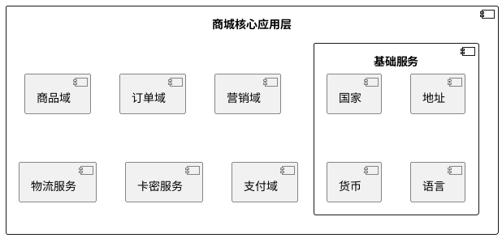

# 商城核心应用层

## 介绍
商城核心应用层主要是对接各个领域的逻辑层，同时实现商城应用程序的核心功能。

## 依赖组件



## 核心能力

### 购物车
> 对接商品领域、营销领域、购物车组件
  - 金额计算（获取商品价格、获取优惠金额）


### 生成订单
   - 订单金额计算
     - 商品价格 --> 商品域
     - 优惠金额 --> 营销域
     - 运费  --> 物流服务
     - 税  --> 税收服务
   - 商品下单
   - 订单支付
   - 卡密发送服务

#### 钩子
| 名称 | 说明 |
|----|----|

#### 事件


### 金额计算
  - 商品服务获，取商品单价
  > 影响单价的因素有 商品、规格、数量、渠道、门店、区域、时间、会员等
  - 对接营销服务，获取商品优惠金额
  > 影响优惠金额的因素有 类目、商品、规格、数量、单价、渠道、门店、区域、时间、会员等，基本上和下单相关产生
  - 对接物流服务，获取订单的运费
### 订单下单

### 订单支付


## 核心流程

```plantuml
<!--@include: ./核心流程.puml-->

```


