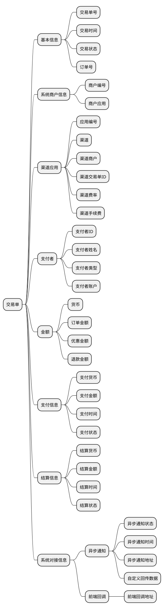

# 支付实体

## 交易单

```puml

@startmindmap

* 交易单
 * 基本信息
  * 交易单号
  * 交易时间
  * 交易状态
  * 订单号
 * 系统商户信息
  * 商户编号
  * 商户应用
 * 渠道应用
  * 应用编号
  * 渠道
  * 渠道商户
  * 渠道交易单ID
  * 渠道费率
  * 渠道手续费
 * 支付者
  * 支付者ID
  * 支付者姓名
  * 支付者类型
  * 支付者账户
 * 金额
  * 货币
  * 订单金额
  * 优惠金额
  * 退款金额
 * 支付信息
  * 支付货币
  * 支付金额
  * 支付时间
  * 支付状态
 * 结算信息
  * 结算货币
  * 结算金额
  * 结算时间
  * 结算状态
 * 系统对接信息
  * 异步通知
   * 异步通知状态
   * 异步通知时间
   * 异步通知地址
   * 自定义回传数据
  * 前端回调
   * 前端回调地址
@end


```
