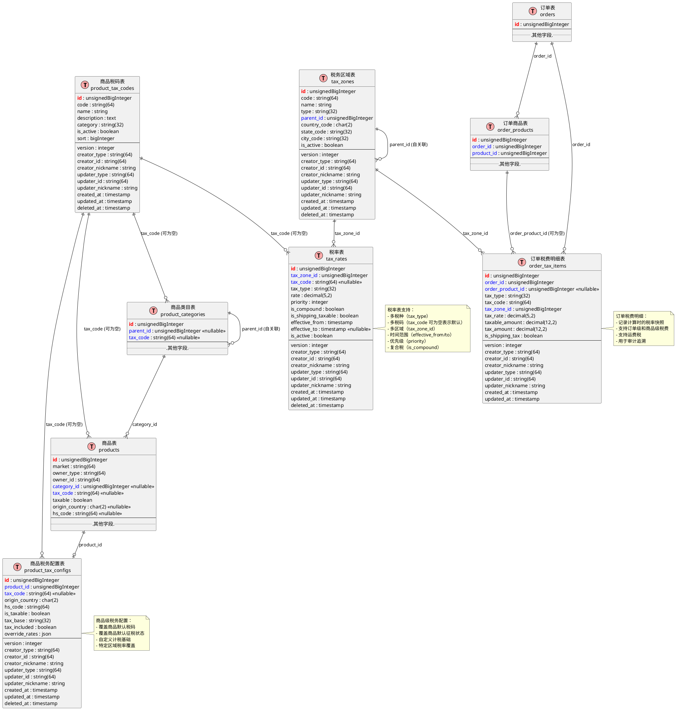

# 商品税设计方案

## 一、设计原则

### 1.1 核心原则
- **多税种支持**：支持增值税（VAT）、消费税、销售税、关税等多种税种
- **多地区适配**：支持不同国家/地区/州的差异化税率
- **自动化计算**：根据商品属性、买家地址、卖家地址自动计算税费
- **合规优先**：确保税务计算的准确性和合规性
- **灵活扩展**：支持复杂的税务规则和特殊场景

### 1.2 参考主流平台
- **Amazon**：多市场、多税种、自动计算
- **Shopify**：税码分类、地区税率、规则引擎
- **WooCommerce**：灵活配置、多税率表
- **eBay**：简化税率、自动计算

## 二、核心概念

### 2.1 税种类型（Tax Type）
```
- VAT（增值税）：欧盟、中国等地区使用
- Sales Tax（销售税）：美国各州使用
- GST（商品服务税）：澳大利亚、加拿大等使用
- Consumption Tax（消费税）：日本等使用
- Customs Duty（关税）：跨境贸易使用
- Excise Tax（消费税）：特定商品（烟酒等）
```

### 2.2 税码分类（Tax Code）
税码用于标识商品的税务分类，不同分类适用不同税率：
```
- STANDARD：标准税率商品
- REDUCED：减税商品（如食品、药品）
- ZERO：零税率商品
- EXEMPT：免税商品
- DIGITAL：数字商品
- PHYSICAL：实物商品
- FOOD：食品类
- CLOTHING：服装类
- BOOKS：图书类
- MEDICAL：医疗用品
```

### 2.3 税务区域（Tax Zone）
```
- 国家级别：如中国、美国、欧盟
- 州/省级别：如加州、纽约州、广东省
- 城市级别：如纽约市、深圳市
- 特殊区域：如自贸区、保税区
```

### 2.4 计税基础（Tax Base）
```
- 商品价格：基于商品售价
- 含运费：商品价格 + 运费
- 含优惠：商品价格 - 优惠金额
- 组合计税：多种基础组合
```

## 三、数据模型设计

### 3.1 商品税码表（product_tax_codes）
```
- id：主键
- code：税码（如 STANDARD、REDUCED）
- name：税码名称
- description：描述
- category：分类（标准/减税/零税/免税）
- is_active：是否启用
- sort：排序
- operator()：操作者信息
- softDeletes()：软删除
```

### 3.2 税务区域表（tax_zones）
```
- id：主键
- code：区域代码（如 CN、US-CA、EU）
- name：区域名称
- type：类型（country/state/city/special）
- parent_id：父级区域ID（支持层级）
- country_code：国家代码（ISO 3166-1 alpha-2）
- state_code：州/省代码
- city_code：城市代码
- is_active：是否启用
- operator()：操作者信息
- softDeletes()：软删除
```

### 3.3 税率表（tax_rates）
```
- id：主键
- tax_zone_id：税务区域ID
- tax_code：税码（可为空，为空表示默认税率）
- tax_type：税种类型（VAT/SALES_TAX/GST等）
- rate：税率（百分比，如 20.00 表示 20%）
- priority：优先级（多个税率时使用）
- is_compound：是否复合税（在已有税额基础上再加税）
- is_shipping_taxable：运费是否计税
- effective_from：生效开始时间
- effective_to：生效结束时间
- is_active：是否启用
- operator()：操作者信息
- softDeletes()：软删除
```

### 3.4 商品税务配置表（product_tax_configs）
```
- id：主键
- product_id：商品ID
- tax_code：税码（覆盖商品默认税码）
- origin_country：原产国（ISO 3166-1 alpha-2）
- hs_code：海关编码（HS Code）
- is_taxable：是否征税（覆盖商品默认值）
- tax_base：计税基础（price/price_with_shipping/price_with_discount）
- tax_included：价格是否含税（true=含税价，false=不含税价）
- override_rates：覆盖税率（JSON，特定区域覆盖）
- operator()：操作者信息
- softDeletes()：软删除
```

### 3.5 订单税费明细表（order_tax_items）
```
- id：主键
- order_id：订单ID
- order_product_id：订单商品ID（可为空，表示订单级税费）
- tax_type：税种类型
- tax_code：税码
- tax_zone_id：税务区域ID
- tax_rate：税率
- taxable_amount：计税金额
- tax_amount：税额
- is_shipping_tax：是否运费税
- operator()：操作者信息
```

## 三、数据模型关系图

### 3.6 ER 关系图



### 3.7 关系说明

#### 3.7.1 核心关系链
```
税务计算流程：
买家地址 → TaxZone（确定税务区域）
    ↓
Product → ProductTaxConfig（商品级配置，可选）
    ↓
ProductTaxCode（确定税码）
    ↓
TaxRate（查询税率：区域 + 税码 + 税种）
    ↓
OrderTaxItem（记录税费明细）
```

#### 3.7.2 税码优先级链
```
1. ProductTaxConfig.tax_code（商品级配置，最高优先级）
   ↓
2. Product.tax_code（商品默认税码）
   ↓
3. ProductCategory.tax_code（类目默认税码）
   ↓
4. TaxRate.tax_code = NULL（区域默认税率，最低优先级）
```

#### 3.7.3 区域层级关系
```
TaxZone（国家）
    ↓ parent_id
TaxZone（州/省）
    ↓ parent_id
TaxZone（城市）
    ↓ parent_id
TaxZone（特殊区域）
```

## 四、商品表字段调整

### 4.1 现有字段保留
```
- taxable：是否征税（默认值）
- tax_code：税码（默认值）
- origin_country：原产国
- hs_code：海关编码
```

### 4.2 移除字段
```
- taxRate：移除单一税率字段，改为通过税率表查询
```

## 五、税务计算逻辑

### 5.1 计算流程
```
1. 确定税务区域
   - 根据买家收货地址确定税务区域
   - 支持国家 -> 州/省 -> 城市的层级匹配
   
2. 获取商品税码
   - 优先使用 product_tax_configs 中的 tax_code
   - 其次使用商品默认 tax_code
   - 最后使用类目默认税码
   
3. 查询税率
   - 根据税务区域 + 税码 + 税种类型查询税率
   - 支持多个税率（优先级排序）
   - 支持复合税计算
   
4. 确定计税基础
   - 根据 product_tax_configs 中的 tax_base 确定
   - 默认使用商品价格
   
5. 计算税额
   - 计税金额 = 计税基础
   - 税额 = 计税金额 × 税率
   - 复合税：在已有税额基础上再加税
   
6. 处理含税价
   - 如果 tax_included = true，需要反算不含税价
   - 不含税价 = 含税价 / (1 + 税率)
```

### 5.2 特殊场景处理
```
- 跨境贸易：计算关税 + 增值税
- 数字商品：适用数字商品税率
- 免税商品：税额为 0
- 运费计税：根据 is_shipping_taxable 决定
- 优惠后计税：根据 tax_base 配置决定
```

## 六、税务规则引擎

### 6.1 规则优先级
```
1. 商品级配置（product_tax_configs）
2. 商品默认税码（products.tax_code）
3. 类目默认税码（product_categories.tax_code）
4. 区域默认税率（tax_rates，tax_code 为空）
```

### 6.2 规则匹配
```
- 精确匹配：税码 + 区域 + 税种
- 模糊匹配：区域 + 税种（使用默认税率）
- 层级匹配：城市 -> 州/省 -> 国家
```

## 七、扩展性设计

### 7.1 多市场支持
```
- 不同市场可以有不同的税率表
- 通过 market 字段关联税率配置
```

### 7.2 时间维度
```
- 税率支持生效时间范围
- 历史订单使用历史税率
- 支持税率变更追溯
```

### 7.3 特殊商品
```
- 支持商品级税率覆盖
- 支持特定区域税率覆盖
- 支持促销期间税率调整
```

### 7.4 税务服务集成
```
- 支持第三方税务服务（如 Avalara、TaxJar）
- 支持 API 实时查询税率
- 支持批量税率更新
```

## 八、合规性考虑

### 8.1 数据记录
```
- 记录完整的税务计算过程
- 保存税率快照（订单创建时）
- 支持税务审计追溯
```

### 8.2 报表支持
```
- 按税种统计税额
- 按区域统计税额
- 按商品分类统计税额
- 支持税务申报报表导出
```

### 8.3 发票支持
```
- 支持含税价/不含税价显示
- 支持税额明细展示
- 支持多税种发票
```

## 九、实施建议

### 9.1 分阶段实施
```
阶段一：基础税率表 + 简单计算
阶段二：税码分类 + 区域匹配
阶段三：规则引擎 + 复杂场景
阶段四：第三方集成 + 自动化
```

### 9.2 数据迁移
```
- 现有 taxRate 字段数据迁移到税率表
- 创建默认税码和税率配置
- 逐步完善区域和税码数据
```

### 9.3 性能优化
```
- 税率数据缓存（Redis）
- 常用税率预计算
- 批量查询优化
```

## 十、最佳实践

### 10.1 税码管理
```
- 使用标准税码（参考 Shopify、WooCommerce）
- 定期更新税码分类
- 保持税码简洁明了
```

### 10.2 税率管理
```
- 定期同步官方税率
- 设置税率变更提醒
- 保留历史税率记录
```

### 10.3 用户体验
```
- 购物车实时显示税费
- 结算页明确展示税额明细
- 支持税费预估（地址输入时）
```

