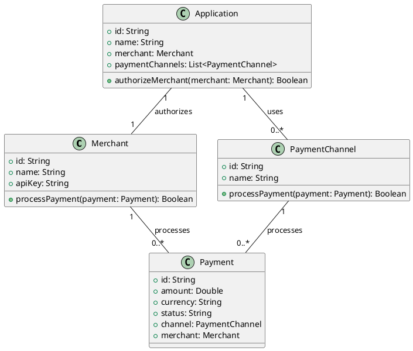

### 1. 引言

#### 1.1 背景介绍
随着电子商务的快速发展，支付系统在各类在线平台中扮演着至关重要的角色。本项目旨在开发一个高效、安全、易用的支付系统，以满足不同商户的需求。

#### 1.2 目标
- **业务目标**: 提供一个稳定可靠的支付解决方案，支持多种支付渠道，简化商户的支付流程。
- **技术目标**: 采用现代化的开发框架和技术栈，确保系统的可扩展性和安全性。

#### 1.3 范围
本文档适用于支付系统的开发团队，涵盖了系统的设计、实现和测试等方面的内容。

### 2. 领域建模

#### 2.1 领域分析
支付系统的核心业务流程包括：
- 商户注册和授权
- 支付请求的处理
- 交易记录的存储和查询
- 支付渠道的管理

#### 2.2 领域模型
使用UML类图展示支付系统的领域模型：

#### 2.3 领域事件
- `MerchantRegistered`: 商户注册成功
- `PaymentProcessed`: 支付请求处理完成
- `PaymentFailed`: 支付请求失败

### 3. 战略设计

#### 3.1 子域划分
- **核心子域**: 支付处理
- **支持子域**: 商户管理、支付渠道管理
- **通用子域**: 日志记录、安全审计

#### 3.2 限界上下文
- **商户管理上下文**: 负责商户的注册、授权和管理。
- **支付处理上下文**: 负责处理支付请求，与支付渠道进行交互。
- **支付渠道管理上下文**: 负责管理支付渠道的配置和状态。

#### 3.3 上下文映射
- **商户管理上下文** 与 **支付处理上下文**: 通过API调用进行交互。
- **支付处理上下文** 与 **支付渠道管理上下文**: 通过事件驱动的方式进行通信。

### 4. 战术设计

#### 4.1 实体
- **Merchant**: 商户实体，包含商户的基本信息和API密钥。
- **PaymentChannel**: 支付渠道实体，包含支付渠道的名称和配置信息。
- **Payment**: 支付实体，包含支付金额、货币、状态等信息。

#### 4.2 值对象
- **Currency**: 货币值对象，表示支付的货币类型。
- **Status**: 状态值对象，表示支付的状态（成功、失败、处理中等）。

#### 4.3 聚合
- **MerchantAggregate**: 商户聚合，包含商户实体和相关的支付信息。
- **PaymentAggregate**: 支付聚合，包含支付实体和支付渠道信息。

#### 4.4 领域服务
- **PaymentService**: 处理支付请求的领域服务。
- **MerchantService**: 管理商户的领域服务。

#### 4.5 仓库
- **MerchantRepository**: 商户仓库，负责持久化和检索商户信息。
- **PaymentRepository**: 支付仓库，负责持久化和检索支付信息。

#### 4.6 工厂
- **MerchantFactory**: 创建商户对象的工厂。
- **PaymentFactory**: 创建支付对象的工厂。

### 5. 架构设计

#### 5.1 架构风格
采用六边形架构（Hexagonal Architecture），确保业务逻辑与外部依赖的解耦。

#### 5.2 模块划分
- **MerchantModule**: 商户管理模块
- **PaymentModule**: 支付处理模块
- **ChannelModule**: 支付渠道管理模块

#### 5.3 数据模型
- **merchants**: 存储商户信息
    - id (Primary Key)
    - name
    - api_key
- **payment_channels**: 存储支付渠道信息
    - id (Primary Key)
    - name
    - config
- **payments**: 存储支付信息
    - id (Primary Key)
    - merchant_id (Foreign Key)
    - channel_id (Foreign Key)
    - amount
    - currency
    - status
    - created_at
    - updated_at

#### 5.4 接口设计
- **商户管理API**
    - POST /api/merchants: 注册商户
    - GET /api/merchants/{id}: 获取商户信息
- **支付处理API**
    - POST /api/payments: 发起支付请求
    - GET /api/payments/{id}: 查询支付状态
- **支付渠道管理API**
    - POST /api/channels: 添加支付渠道
    - GET /api/channels: 获取支付渠道列表

#### 5.5 安全设计
- **身份验证**: 使用JWT进行身份验证。
- **授权**: 使用RBAC（基于角色的访问控制）进行权限管理。
- **数据加密**: 敏感数据（如API密钥）使用AES加密。

### 6. 技术选型

#### 6.1 编程语言
- **PHP**

#### 6.2 框架
- **Laravel**

#### 6.3 数据库
- **MySQL**

#### 6.4 中间件
- **Redis**: 用于缓存和消息队列
- **RabbitMQ**: 用于异步任务处理

#### 6.5 工具
- **Postman**: API测试工具
- **Docker**: 容器化部署工具
- **Git**: 版本控制系统

### 7. 开发计划

#### 7.1 里程碑
- **M1**: 完成需求分析和领域建模
- **M2**: 完成架构设计和技术选型
- **M3**: 完成核心功能开发
- **M4**: 完成测试和优化
- **M5**: 上线部署

#### 7.2 任务分解
- **需求分析**: 2周
- **领域建模**: 1周
- **架构设计**: 1周
- **核心功能开发**: 6周
- **测试和优化**: 3周
- **上线部署**: 1周

#### 7.3 风险评估
- **技术风险**: 新技术的学习曲线
- **业务风险**: 商户需求变化
- **应对措施**: 提前进行技术预研，定期与商户沟通需求

### 8. 测试计划

#### 8.1 测试策略
- **单元测试**: 使用PHPUnit进行单元测试
- **集成测试**: 使用Postman进行API测试
- **端到端测试**: 使用Cypress进行前端测试

#### 8.2 测试用例
- **商户注册**: 测试商户注册的完整流程
- **支付请求**: 测试支付请求的发起和处理
- **支付状态查询**: 测试支付状态的查询

#### 8.3 测试工具
- **PHPUnit**: 单元测试
- **Postman**: API测试
- **Cypress**: 前端测试

### 9. 运维和监控

#### 9.1 部署方案
- **环境配置**: 使用Docker进行环境配置
- **部署流程**: 使用CI/CD流水线进行自动化部署

#### 9.2 监控方案
- **Prometheus**: 监控系统性能指标
- **Grafana**: 可视化监控数据
- **Sentry**: 错误日志收集和报警

#### 9.3 备份和恢复
- **数据备份**: 每天自动备份数据库
- **恢复策略**: 使用备份数据进行快速恢复

### 10. 附录

#### 10.1 术语表
- **商户**: 使用支付系统的商家
- **支付渠道**: 支付方式，如信用卡、支付宝等
- **聚合**: 一组相关对象的集合，具有独立的生命周期

#### 10.2 参考资料
- **《领域驱动设计》**: Eric Evans
- **Laravel官方文档**: https://laravel.com/docs
- **六边形架构**: Alistair Cockburn

#### 10.3 变更记录
- **v1.0**: 初始版本
- **v1.1**: 增加支付渠道管理模块

通过上述文档，开发团队可以清晰地了解支付系统的整体设计和实现细节，确保项目的顺利进行。
