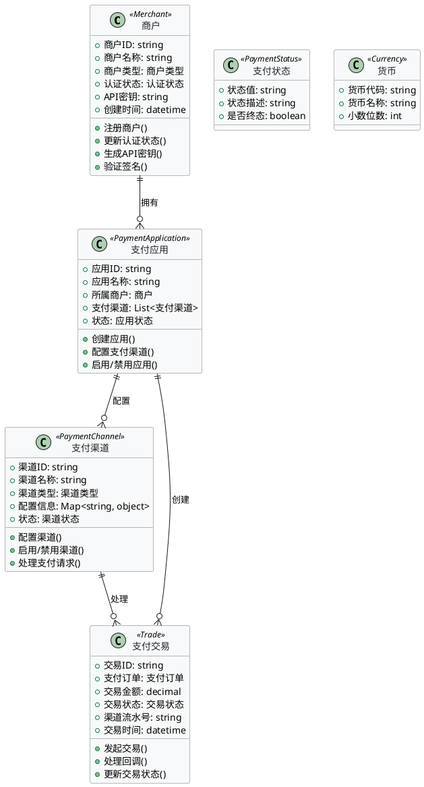
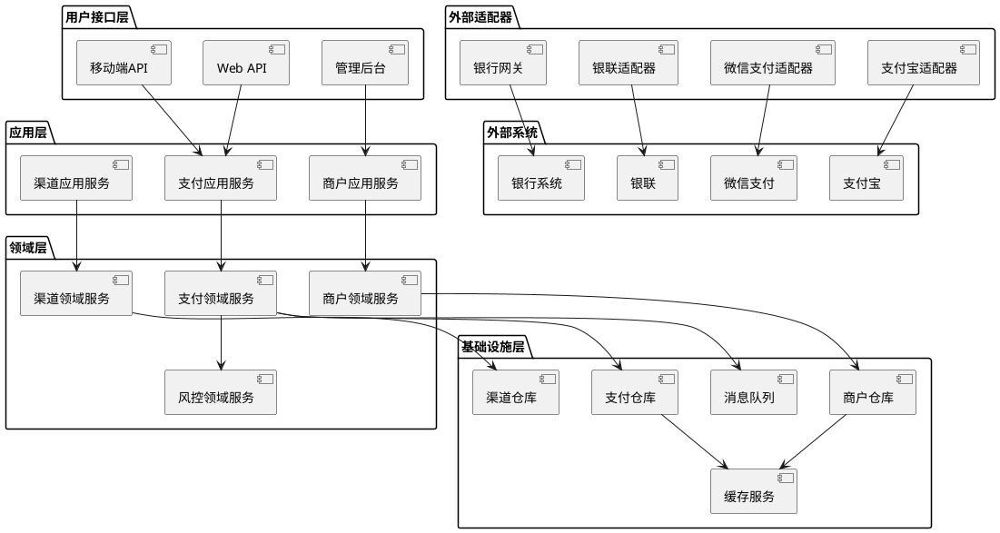

# 技术方案设计文档

## 1. 引言

### 1.1 背景介绍
随着电子商务的快速发展和数字化转型的深入推进，支付系统作为电商平台的核心基础设施，承担着连接用户、商户、银行和第三方支付机构的重要桥梁作用。本项目旨在构建一个高性能、高可用、高安全的现代化支付系统，为电商平台提供稳定可靠的支付服务支撑。

### 1.2 项目目标
- **业务目标**：
  - 提供统一的支付接入服务，支持多种支付方式
  - 简化商户接入流程，降低技术门槛
  - 提升支付成功率，优化用户体验
  - 建立完善的支付风控体系，保障资金安全

- **技术目标**：
  - 采用领域驱动设计（DDD）架构，提升系统可维护性
  - 实现微服务化架构，支持水平扩展
  - 建立完善的监控和告警体系
  - 确保系统高可用性（99.9%以上）

### 1.3 适用范围
本技术方案适用于支付系统的设计、开发、测试和运维团队，涵盖系统架构设计、技术选型、开发规范、部署方案等各个方面。

## 2. 领域建模

### 2.1 领域分析
支付系统的核心业务流程包括：
- **商户管理**：商户注册、认证、授权、配置管理
- **支付处理**：支付请求接收、路由、处理、结果返回
- **渠道管理**：支付渠道配置、状态监控、故障切换
- **风控管理**：风险检测、规则引擎、异常处理
- **对账清算**：交易对账、资金清算、差错处理

### 2.2 领域模型



### 2.3 领域事件
- **商户注册成功事件**：商户完成注册并激活
- **支付订单创建事件**：新的支付订单被创建
- **支付交易发起事件**：支付交易开始处理
- **支付交易成功事件**：支付交易成功完成
- **支付交易失败事件**：支付交易处理失败
- **渠道状态变更事件**：支付渠道状态发生变化

## 3. 战略设计

### 3.1 子域划分
- **核心子域**：支付处理、交易管理
- **支撑子域**：商户管理、渠道管理、风控管理
- **通用子域**：用户管理、日志记录、通知服务

### 3.2 限界上下文
- **商户管理上下文**：负责商户的注册、认证、授权和管理
- **支付处理上下文**：负责支付请求的处理、路由和结果返回
- **渠道管理上下文**：负责支付渠道的配置、监控和故障处理
- **风控管理上下文**：负责风险检测、规则执行和异常处理
- **对账清算上下文**：负责交易对账、资金清算和差错处理

### 3.3 上下文映射
- **商户管理上下文** ↔ **支付处理上下文**：通过API调用进行交互
- **支付处理上下文** ↔ **渠道管理上下文**：通过事件驱动进行通信
- **支付处理上下文** ↔ **风控管理上下文**：通过同步调用进行风险检查
- **支付处理上下文** ↔ **对账清算上下文**：通过异步事件进行数据同步

## 4. 战术设计

### 4.1 实体设计
- **商户实体**：聚合根，包含商户基本信息和认证状态
- **支付应用实体**：聚合根，管理商户的支付应用配置
- **支付订单实体**：聚合根，管理支付订单的生命周期
- **支付交易实体**：聚合根，管理支付交易的执行过程

### 4.2 值对象设计
- **支付状态值对象**：表示支付订单的各种状态
- **货币值对象**：表示支持的货币类型
- **金额值对象**：表示金额及其计算逻辑
- **时间戳值对象**：表示各种时间信息

### 4.3 聚合设计
- **商户聚合**：包含商户实体和相关的支付应用
- **支付订单聚合**：包含支付订单实体和相关的支付交易
- **渠道聚合**：包含支付渠道实体和配置信息

### 4.4 领域服务
- **支付处理服务**：协调支付订单和支付交易的处理流程
- **渠道路由服务**：根据规则选择合适的支付渠道
- **风控检查服务**：执行风险检测和规则验证
- **对账服务**：处理交易对账和差错处理

### 4.5 仓库接口
- **商户仓库**：负责商户信息的持久化和检索
- **支付订单仓库**：负责支付订单的持久化和检索
- **支付交易仓库**：负责支付交易的持久化和检索
- **渠道仓库**：负责支付渠道配置的持久化和检索

### 4.6 工厂模式
- **商户工厂**：创建商户对象，处理复杂的创建逻辑
- **支付订单工厂**：创建支付订单对象，设置初始状态
- **支付交易工厂**：创建支付交易对象，关联支付订单

### 4.7 业务异常分类
- **验证异常**：输入参数验证失败
- **业务异常**：业务规则违反
- **系统异常**：系统内部错误
- **外部异常**：第三方服务调用失败

## 5. 架构设计

### 5.1 架构风格
采用**六边形架构（Hexagonal Architecture）**，确保业务逻辑与外部依赖的解耦，提高系统的可测试性和可维护性。

### 5.2 系统架构图



### 5.3 模块划分
- **支付模块**：处理支付请求、订单管理、交易处理
- **商户模块**：商户管理、应用管理、权限控制
- **渠道模块**：渠道配置、路由管理、状态监控
- **风控模块**：风险检测、规则引擎、异常处理
- **对账模块**：交易对账、资金清算、差错处理

### 5.4 数据模型设计

#### 5.4.1 核心数据表
```sql
-- 支付订单表（核心业务表）
CREATE TABLE payment_orders (
    id BIGINT UNSIGNED PRIMARY KEY COMMENT '订单ID',
    order_no VARCHAR(64) UNIQUE NOT NULL COMMENT '订单号',
    merchant_order_no VARCHAR(64) NOT NULL COMMENT '商户订单号',
    merchant_id BIGINT UNSIGNED NOT NULL COMMENT '商户ID',
    app_id BIGINT UNSIGNED NOT NULL COMMENT '应用ID',
    amount DECIMAL(10,2) NOT NULL COMMENT '支付金额',
    currency VARCHAR(3) DEFAULT 'CNY' COMMENT '支付货币',
    subject VARCHAR(200) NOT NULL COMMENT '商品标题',
    body TEXT COMMENT '商品描述',
    status ENUM('pending', 'processing', 'success', 'failed', 'cancelled') DEFAULT 'pending' COMMENT '订单状态',
    channel_id BIGINT UNSIGNED COMMENT '支付渠道ID',
    notify_url VARCHAR(255) COMMENT '回调通知地址',
    return_url VARCHAR(255) COMMENT '支付完成跳转地址',
    expire_time TIMESTAMP COMMENT '订单过期时间',
    paid_time TIMESTAMP NULL COMMENT '支付完成时间',
    created_at TIMESTAMP DEFAULT CURRENT_TIMESTAMP COMMENT '创建时间',
    updated_at TIMESTAMP DEFAULT CURRENT_TIMESTAMP ON UPDATE CURRENT_TIMESTAMP COMMENT '更新时间',
    INDEX idx_order_no (order_no),
    INDEX idx_merchant_order_no (merchant_order_no),
    INDEX idx_merchant_id (merchant_id),
    INDEX idx_status (status),
    INDEX idx_created_at (created_at)
) COMMENT='支付订单表';
```

### 5.5 接口设计

#### 5.5.1 核心API接口
```yaml
# 支付核心接口
POST /api/v1/payments/create
  - 功能：创建支付订单
  - 参数：merchant_order_no, amount, subject, body, notify_url, return_url
  - 返回：order_no, payment_url

POST /api/v1/payments/query
  - 功能：查询支付订单状态
  - 参数：order_no 或 merchant_order_no
  - 返回：订单详细信息

POST /api/v1/payments/refund
  - 功能：申请退款
  - 参数：order_no, refund_amount, refund_reason
  - 返回：refund_no
```

### 5.6 安全设计

#### 5.6.1 身份认证
- **API密钥认证**：商户通过API Key和API Secret进行身份认证
- **JWT令牌**：内部服务间使用JWT令牌进行认证
- **OAuth2.0**：支持第三方应用的OAuth2.0认证

#### 5.6.2 数据安全
- **数据加密**：敏感数据使用AES-256加密存储
- **传输加密**：所有API调用使用HTTPS/TLS加密
- **签名验证**：API请求使用HMAC-SHA256签名验证

#### 5.6.3 访问控制
- **RBAC权限模型**：基于角色的访问控制
- **API限流**：基于商户和应用级别的API调用限流
- **IP白名单**：支持IP地址白名单限制

## 6. 附录

### 6.1 术语表
| 术语 | 定义 | 说明 |
|------|------|------|
| 商户 | 使用支付系统的商家 | 包括个人商户和企业商户 |
| 支付渠道 | 支付方式，如支付宝、微信支付等 | 支持多种支付方式 |
| 支付订单 | 用户发起的支付请求 | 包含支付金额、商品信息等 |
| 支付交易 | 实际的资金流转过程 | 与第三方支付渠道交互 |
| 聚合 | 一组相关对象的集合 | 具有独立的生命周期和一致性边界 |
| 限界上下文 | 领域模型的边界 | 明确模型的适用范围 |

### 6.2 参考资料
- **《领域驱动设计》**：Eric Evans
- **《微服务设计》**：Sam Newman
- **《高性能MySQL》**：Baron Schwartz
- **《Redis设计与实现》**：黄健宏
- **Laravel官方文档**：https://laravel.com/docs
- **支付宝开放平台文档**：https://open.alipay.com/
- **微信支付文档**：https://pay.weixin.qq.com/

### 6.3 变更记录
| 版本 | 日期 | 变更内容 | 变更人 |
|------|------|----------|--------|
| v1.0 | 2024-01-01 | 初始版本 | 技术团队 |
| v1.1 | 2024-01-15 | 增加风控模块设计 | 技术团队 |
| v1.2 | 2024-02-01 | 精简为领域方案设计 | 技术团队 |

---

**文档说明**：
本技术方案文档专注于支付系统的领域方案设计，涵盖了从领域建模到架构设计的核心内容。开发团队应严格按照本方案进行系统设计和开发，确保系统的质量、性能和安全性。如有疑问或需要调整，请及时与技术负责人沟通。
